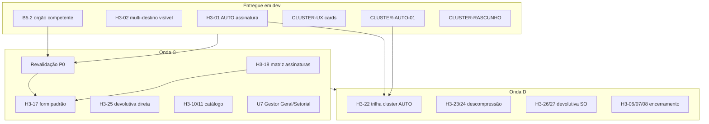

# Roadmap de ajustes — SGDL homologação (jun/2026)

> **Documento limpo** para revisão e validação de produto.  
> Consolida: rodadas de homologação (A1–A5, Onda B), achados H3 (rodadas 1 e 2), entregas de desenvolvimento recentes e backlog priorizado.  
> **Não substitui** o roteiro operacional — use [ROTEIRO-HOMOLOGACAO-COMPLETO.md](operacao/ROTEIRO-HOMOLOGACAO-COMPLETO.md) para executar testes passo a passo.

**Ambiente:** https://sgdl.mogidascruzes.sp.gov.br  
**Gate atual:** **GO condicional** — piloto 2ª quinzena jun/2026  
**Elaborado:** 2026-06-18 · **Status doc:** rascunho para validação

---

## 1. Objetivo deste roadmap

Organizar **tudo que mapeamos para ajuste** em três camadas:

1. **Entregue em dev** — aguardando deploy + revalidação operacional  
2. **Decidido / especificado** — pronto para implementação  
3. **Backlog priorizado** — ondas C, D e E

Critério de **pronto para piloto ampliado**: Onda C concluída (revalidações P0 + estabilização B5/cluster).

---

## 2. Linha do tempo resumida

| Marco | Situação |
|-------|----------|
| Gate A1–A5 (Copiloto, assinaturas, RBAC, P8) | **Validado** 2026-06-10 |
| Onda B (B1–B9) — implementação base | **Majoritariamente OK** em homologação |
| Rodada H3 (operadores) | Achados registrados; vários fixes em dev |
| Rodada 2 H3-17…H3-28 | Especificação produto; backlog ondas C/D |
| Sessão dev jun/2026 (multi-órgão, cluster, rascunho) | Entregas abaixo — **pendente deploy/revalidação** |

---

## 3. Entregue em dev — aguardando revalidação

Itens implementados no código; **não considerados fechados** até teste operacional pós-`reload gunicorn-sgdl` + `npm run build`.

| ID | Tema | O que foi feito | Evidência dev | Revalidar |
|----|------|-----------------|---------------|-----------|
| **H3-01** | Fluxo AUTO × assinaturas | Despacho automático registra assinatura **Sistema SGDL** (`DESPACHO AUTOMATICO DO SISTEMA`); manual mantém Protocolo + Gestor (A4) | `test_fluxo_protocolo`, [fluxo-auto-manual.md](operacao/fluxo-auto-manual.md) | Serviço com fluxo AUTO na carta |
| **H3-02** | Visibilidade multi-destino (B5) | Clusters multi-órgão **não** sofrem filtro «apenas líder» da Super OS; secretaria B abre clone | `test_despacho_multi_visibilidade` | Roteiro §2.2 + §3.1 |
| **H3-20** | Copiloto «Não» | Recusa na validação final volta ao fluxo editável | `test_copiloto_recusa_validacao` | Copiloto → gerar rascunhos → Não |
| **B5.2** | Multi-órgão sem «sujar» competente | Órgão da **carta** permanece no processo principal; demais secretarias = **órgãos integrados** (desdobramentos) | `test_despacho_destinos` | Despacho Protocolo com 2+ secretarias |
| **FIX-3024** | Numeração ofício `-D2` | `proximo_protocolo_legislativo` ignora sufixos multi-despacho; evita `IntegrityError` | `test_protocolo_numeracao` | Reenvio após falha 500 |
| **CLUSTER-UX-01** | Card cluster na tela `/clusters` | Metadados enriquecidos (tipo multi-órgão, órgãos, competente, líder); deep-link `?id=` | Serializer + `ClustersView` | `/clusters?id=29` |
| **CLUSTER-UX-02** | Card cluster no **detalhe da demanda** | Processos vinculados visíveis também em clusters **multi-órgão** (antes só Super OS semântica) | `info_operacional_super_os` + `DemandaDetailView` | Demanda #3055, cluster #29 |
| **CLUSTER-AUTO-01** | Auto-protocolo em Super OS existente | Nova demanda na fila que entra em cluster **já despachado** é protocolada automaticamente (fluxo AUTO) | `test_auto_protocola_demanda_nova_em_super_os_existente` | Cluster com 2 protocoladas + 1 aguardando |
| **CLUSTER-RASCUNHO** | Rascunho fora do cluster | Rascunhos **nunca** clusterizam; perdem vínculo ao voltar a `RASCUNHO`; Super OS só conta membros válidos | `test_cluster_par_formacao` (5 testes) | Criar 2 rascunhos mesmo serviço/geo |
| **H3-14/15** | UX gestão usuários U5 | Checkbox «Alterar senha»; anti-autofill busca; backend ignora senha vazia | `test_usuario_gestao_unificado` | `/gestao-usuarios` — editar sem trocar senha |
| **U5-UX** | Vínculos UA no formulário U5 | Resumo «Atuação vinculada hoje»; merge opções MultiSelect | `GestaoUsuariosView.vue` | Editar secretaria/gestor com setores visíveis |
| **U7** | Gestor Geral vs Setorial (escopo + admin) | `gestor_escopo.py`, filtros demanda/cluster, admin 403 | `test_gestor_escopo` | Gestor setorial vs geral |

### Deploy pendente (operador técnico)

```bash
cd /var/www/sgdl/backend && source ../venv/bin/activate
python manage.py check --deploy
python manage.py test core.tests.test_despacho_destinos \
  core.tests.test_despacho_multi_visibilidade \
  core.tests.test_cluster_par_formacao \
  core.tests.test_fluxo_protocolo \
  core.tests.test_copiloto_recusa_validacao \
  core.tests.test_gestor_escopo \
  --settings=config.settings_test --keepdb -v1
cd /var/www/sgdl/frontend && npm run build
sudo systemctl reload gunicorn-sgdl
```

> **Testes:** use sempre `--settings=config.settings_test --keepdb` — reutiliza o Postgres de homologação (sem `CREATE DATABASE`). Sem isso: `permission denied to create database`.

---

## 4. Baseline já homologada (não reabrir salvo regressão)

| Bloco | Itens | Status homologação |
|-------|-------|-------------------|
| **A1–A5** | Copiloto FAQ, P8, assinaturas, RBAC secretaria | OK |
| **B1–B3** | Geocoding MC, PDF sem data dup., anexos dup. | OK |
| **B6–B9** | Cargo assinatura, painel despacho assinado, anexos B8, timeline multilinha | OK |
| **O1** | Trilha Ouvidoria (#13) | OK (catálogo órgão — ver H3-10/11) |
| **SIN** | Sinalização placa → serviço 133 | OK |
| **U5** | Gestão de usuários — hub `/gestao-usuarios` (H3-14/15 + vínculos UA) | **OK** jun/2026 |

Matriz detalhada: [ROTEIRO-HOMOLOGACAO-COMPLETO.md § Matriz única](operacao/ROTEIRO-HOMOLOGACAO-COMPLETO.md).

---

## 5. Onda C — Estabilização (antes do piloto ampliado)

**Meta:** fechar bloqueantes e incômodos que impedem operação diária Protocolo + 2 secretarias.

| P | ID | Entrega | Tipo | Depende de | Critério de pronto |
|---|-----|---------|------|------------|-------------------|
| **P0** | **H3-02** | Revalidar multi-destino pós-deploy | Revalidação | CLUSTER-UX, B5.2 | Secretaria B abre clone; órgão competente correto no principal |
| **P0** | **H3-01** | Revalidar fluxo AUTO + assinatura sistema | Revalidação | Deploy | Tramitação AUTO com registro sistema; manual inalterado |
| **P0** | **H3-20** | Revalidar Copiloto «Não» | Revalidação | Deploy | Fluxo editável após recusa |
| **P0** | **B5.2** | Revalidar despacho integrado multi-órgão | Revalidação | Deploy | UI «órgãos integrados»; principal = carta |
| **P0** | **CLUSTER-UX** | Revalidar cards cluster (#29, #3055) | Revalidação | Deploy | Card no detalhe + gestor clusters |
| **P1** | **H3-17** | **Formulário padrão** de tramitação (órgão → UA search, assinatura opcional, anexos, descrição) | Dev | H3-18 | Um componente para Despacho + Andamentos |
| **P1** | **H3-18** | Matriz de assinaturas por tipo (consolidada) | Especificação → dev | H3-01 | Tabela no roteiro implementada na UI/API |
| **P1** | **H3-25** | Simplificar **Conclusão → Devolutiva** (sem «Solicitação Devolutiva») | Dev | — | Menos um passo na secretaria |
| **P1** | **H3-10/11** | Sync catálogo Sinapse — GABP (#49) / Ouvidoria | Dados + config | [runbook-sync-sinapse.md](operacao/runbook-sync-sinapse.md) | O1 despacha para órgão correto pós-reforma |
| **P1** | **B4** | Timeline vereador: marcos com **órgão + setor** | Dev/refino | A2 OK | Não só «Prefeitura» genérico |
| **P1** | **H3-28** + **H3-16** | **Gestor Geral** vs **Gestor Setorial** (RBAC escopo + admin) | Dev | U7 | Ver §5.2 · **revalidar** |

**Estimativa:** 1–2 sprints focados (revalidação + H3-17/25 + catálogo).

---

## 5.1 Gestão de usuários — hub U5 (`/gestao-usuarios`) — **homologado**

Tela unificada de cadastro: **Perfil → Órgão › Setor → Conta**. API: `/api/gestao-usuarios/`. Especificação: [modulo-usuarios-perfis.md](especificacoes/modulo-usuarios-perfis.md) §7.

| ID | Problema reportado | Correção | Status |
|----|-------------------|----------|--------|
| **H3-14** | Senha alterada **sem intenção** ao editar | Checkbox «Alterar senha»; `autocomplete="new-password"`; backend ignora senha vazia | **Resolvido** |
| **H3-15** | Após salvar, lista filtrava por **«admin»** | `autocomplete="off"` na busca; restaura filtro se autofill | **Resolvido** |
| **U5-UX** | Vínculos UA **não apareciam** no formulário | Bloco «Atuação vinculada hoje»; opções MultiSelect mescladas com UAs já vinculadas | **Resolvido** |

**Arquivos:** `frontend/src/views/GestaoUsuariosView.vue` · `backend/core/serializers.py`.

---

## 5.2 Gestor Geral vs Gestor Setorial (H3-16 / H3-28) — **implementado**

Decisão de produto **jun/2026**. Um perfil `GESTOR`; subtipo derivado do **cadastro de vínculos** em `/gestao-usuarios`.

| Subtipo | Vínculo | Dados | Permissões |
|---------|---------|-------|------------|
| **Gestor Geral** | **Sem** órgão e **sem** setor UA | **Todo** o SGDL | **CRUD administrativo pleno** — Django Admin, gestão usuários, carta, FAQ, import RM, configurações |
| **Gestor Setorial** | **Um ou mais** órgãos e/ou setores UA | **Escopo vinculado** — demandas, filas, clusters, relatórios do(s) órgão(s)/setor(es) | **Tramitações gerenciais** no escopo (despacho, andamentos, devolutiva); **sem** admin global |

### Classificação no cadastro

```text
GESTOR ∧ ¬órgão ∧ ¬setor(es)  →  Gestor Geral
GESTOR ∧ (órgão ∨ setor(es))  →  Gestor Setorial
```

Multi-setor / multi-órgão: escopo = **união** dos vínculos (ex.: Mobilidade + Obras se ambos cadastrados).

### Entregas técnicas (U7)

| # | Entrega | Camada |
|---|---------|--------|
| 1 | `tipo_gestor(usuario)` → `GERAL` \| `SETORIAL` | `usuario_vinculo_service.py` |
| 2 | Filtro de queryset em demandas, clusters, relatórios, dashboard | views + filters |
| 3 | 403 em rotas admin-only para Setorial (carta, FAQ, gestão usuários, import RM) | permissions |
| 4 | Rótulo subtipo na listagem e formulário U5 | `GestaoUsuariosView.vue` |
| 5 | `is_staff`/`is_superuser`: Geral = pleno; Setorial = sem superuser (ou staff limitado) | serializers gestor |
| 6 | Testes API escopo Setorial vs Geral | `test_usuario_gestao_*`, `test_demanda_*` |

**Critério de pronto:** gestor Mobilidade (setorial) lista só demandas do órgão/setor vinculado; gestor `admin` sem vínculo mantém visão global e `/admin/`.

**Referência completa:** [modulo-usuarios-perfis.md §2.4](especificacoes/modulo-usuarios-perfis.md).

---

## 6. Onda D — Cluster, devolutiva avançada, encerramento

**Meta:** maturar Super OS e fechar ciclo legislativo com menos fricção.

| P | ID | Entrega | Notas |
|---|-----|---------|-------|
| **P1** | **H3-22** | Despacho automático **auditável** ao entrar em cluster | **Parcial:** CLUSTER-AUTO-01 cobre Super OS existente; falta trilha explícita na UI/timeline |
| **P2** | **H3-23/24** | Super OS: modal ofícios do líder + **Descompressão** | Par funcional |
| **P2** | **H3-26/27** + **H3-04** | Devolutiva Super OS (todos/selecionar vereadores) + cópia Gestor | Complementa multiselect órgãos |
| **P2** | **H3-05** | Anexos da **Conclusão do Serviço** no pacote devolutiva | Estende B8 |
| **P2** | **H3-06** | Layout **Prefeitura** no ofício resposta ao cidadão | Distinto de ConfiguracaoOficio Câmara |
| **P2** | **H3-12** | Assinaturas **inline** em cada passo da timeline | UX Protocolo/Secretaria |
| **P3** | **H3-19** | Timeline vereador: todos os passos, sem detalhe interno (exceto conclusão/devolutiva) | Refina P8/B4 |
| **P3** | **H3-08** | Pesquisa satisfação (5★ + texto) — **aprovada produto** | No encerramento vereador |
| **P3** | **H3-07** | `FINALIZADO` automático após prazo sem ciência | Job + auditoria |
| **P3** | **H3-21** | B3 em «Editar rascunho do ofício» | Estende B3 |

---

## 7. Onda E — Evolução Sinapse + MOVA (pós-piloto)

Trilha estratégica; **não bloqueia** piloto jun/2026.

| Tema | Referência | Status |
|------|------------|--------|
| Interoperabilidade Sinapse (cliente isolado, sync auditável) | [evolucao-sinapse-mova.mdc](../.cursor/rules/evolucao-sinapse-mova.mdc) | Contínuo |
| UX guiado Copiloto (etapas + confirmação antes de protocolar) | Roadmap produto fase 2 | Parcial |
| IA assistiva (sugestão + validação humana) | Copiloto, triagem | Em produção |
| Lazy load + paginação DataTables críticas | ROADMAP_PRODUTO | Pendente |
| Encerramento legislativo avançado + NPS | H3-07/08 | Onda D |

Detalhe fases 1–6: [ROADMAP_PRODUTO.md](ROADMAP_PRODUTO.md).

---

## 8. Mapa de dependências (simplificado)



---

## 9. Decisões de produto registradas (não redecidir sem revisão)

| Decisão | Data | Implicação |
|---------|------|------------|
| Despacho **manual** multi-órgão: principal = órgão da **carta**; demais = **integrados** | jun/2026 | B5.2; não alterar `sinapse_orgao_id` do líder para secretaria adicionada |
| Fluxo **AUTO**: assinatura do usuário sistema, não Protocolo humano | jun/2026 | H3-01 + H3-18 |
| Cluster **multi-órgão** ≠ Super OS semântica (regras de fila distintas) | jun/2026 | H3-02 |
| **Rascunho** nunca participa de cluster | jun/2026 | CLUSTER-RASCUNHO |
| Pesquisa satisfação no encerramento | jun/2026 | H3-08 aprovada — programar Onda D |
| Formulário único tramitação (H3-17) absorve H3-03/13 | jun/2026 | Onda C |
| **Gestor Geral** (sem vínculo) vs **Gestor Setorial** (com órgão/setor) | jun/2026 | H3-16/H3-28 · U7 · §5.2 |
| Hub U5 gestão usuários homologado (H3-14/15 + vínculos) | jun/2026 | Baseline §4 — não reabrir |

---

## 10. Riscos e mitigações

| Risco | Impacto | Mitigação |
|-------|---------|-----------|
| Deploy sem reload Gunicorn | Fixes invisíveis em prod | Checklist Fase 0 + registro SHA |
| Catálogo Sinapse desatualizado (GABP/Ouvidoria) | Despacho AUTO/manual para órgão errado | H3-10/11 + sync antes piloto ampliado |
| Confusão Super OS × multi-órgão | Operadores despacham lote errado | CLUSTER-UX labels + treinamento |
| Rascunhos simultâneos mesmo serviço | Cluster prematuro após envio | CLUSTER-RASCUNHO + `deve_aguardar_par` |
| Fluxo AUTO sem trilha visível | Auditoria questionada | H3-22 completa trilha na timeline |

---

## 11. Critérios de go/no-go piloto ampliado

| # | Critério | Responsável |
|---|----------|-------------|
| 1 | Onda C **P0** revalidada (H3-02, H3-01, B5.2, CLUSTER-UX) | Protocolo + 2 secretarias |
| 2 | `check --deploy` + testes P0 verdes | DevOps |
| 3 | Backup restaurável documentado | DevOps |
| 4 | H3-10/11 endereçado ou aceito como limitação conhecida | Gestão + Protocolo |
| 5 | Registro de execução atualizado no roteiro mestre | PO homologação |

---

## 12. Referências (documentação existente)

| Documento | Uso |
|-----------|-----|
| [ROTEIRO-HOMOLOGACAO-COMPLETO.md](operacao/ROTEIRO-HOMOLOGACAO-COMPLETO.md) | Roteiro guiado de testes |
| [homologacao-e2e-registro.md](operacao/homologacao-e2e-registro.md) | Registro formal de bugs H2 |
| [piloto-apontamentos-jun2026.md](operacao/piloto-apontamentos-jun2026.md) | Origem Onda B |
| [fluxo-auto-manual.md](operacao/fluxo-auto-manual.md) | AUTO vs manual por serviço |
| [roteiro-b5-b8-homologacao.md](operacao/roteiro-b5-b8-homologacao.md) | Cenários B5/B8 |
| [ROADMAP.md](ROADMAP.md) | Painel histórico (parcialmente desatualizado) |
| [ROADMAP_PRODUTO.md](ROADMAP_PRODUTO.md) | Fases 1–6 produto |

---

## 13. Próximo passo sugerido (validação deste doc)

1. **Revisar** tabela §3 (entregue em dev) — confirmar o que entra no próximo deploy.  
2. **Priorizar** Onda C — validar se H3-17/25 entram no mesmo sprint ou após revalidação P0.  
3. **Atualizar** [ROADMAP.md](ROADMAP.md) com link para este arquivo após aprovação.  
4. **Executar** checklist §3 deploy + marcar revalidações no roteiro mestre.

---

*Documento gerado a partir da consolidação: conversas de homologação jun/2026, ROTEIRO-HOMOLOGACAO-COMPLETO, piloto-apontamentos, homologacao-e2e-registro e entregas de código da sessão de desenvolvimento.*
