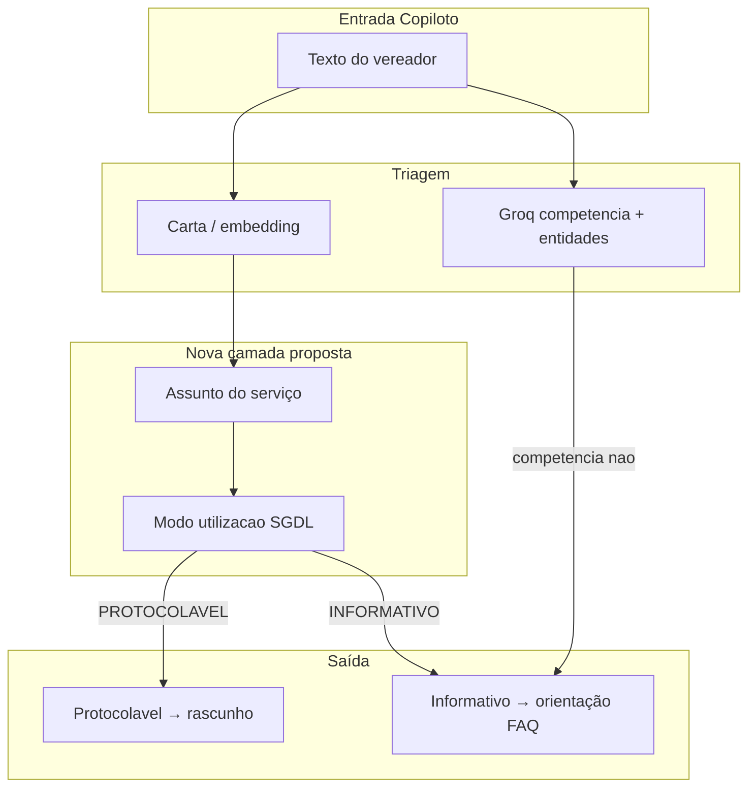

# Proposta em discussão — Assuntos temáticos, política de utilização e importação de unidades (RM271698)

> **Status:** **implementado** (jun/2026) — C5 + C6 entregues conforme decisões §6.  
> Índice: [README.md](../README.md) · Carta Onda 3: [carta-consulta-evolucao.md](carta-consulta-evolucao.md) · Roadmap: [ROADMAP_PRODUTO.md](../ROADMAP_PRODUTO.md)

Este texto registra duas linhas de evolução levantadas para a **gestão da carta de serviços** no SGDL:

1. **Taxonomia de assuntos temáticos** + **política de utilização** (protocolável vs. apenas informativo no Copiloto).
2. **Carga da planilha oficial de unidades administrativas** (`docs/RM271698 - UNIDADES (1).xlsx`) na base local de setores (`UnidadeAdministrativa`), complementando o vínculo carta → setor (C2).

---

## 1. Contexto

### O que já existe no SGDL

| Mecanismo | O que faz hoje | Limite |
|-----------|----------------|--------|
| **Carta Sinapse + `ServicoOtimizado`** | Catálogo de serviços; prazo, embedding, vínculo setor (C2) | Serviços **não** agrupados por assunto temático de gestão |
| **`competencia_municipal` (Groq)** | Por item do rascunho: `sim` / `nao` / `incerto` — bloqueia ofício fora da competência | Decisão **por texto**, não por **política estável do serviço** |
| **FAQ Copiloto (`CopilotoFaqOrientacao`)** | Orientação para temas recorrentes fora de protocolo (consumidor, estadual, etc.) | Não ligada à carta serviço-a-serviço |
| **`copiloto_dominio`** | Domínios operacionais (ex.: mobilidade) para triagem | Conjunto pequeno e técnico; ≠ assuntos institucionais de gestão |
| **`UnidadeAdministrativa`** | Setores locais por `sinapse_orgao_id`; cadastro manual em `/gestao-setores` | Poucas unidades; sem espelho da estrutura RM/SEI |
| **C2 — carta → setor** | `ServicoOtimizado.unidade_administrativa` + despacho | Depende de setores existentes e mapeados |

### Lacuna que motiva a proposta

- Existe uma **lista institucional de assuntos** (15 temas) usada na gestão da carta, mas **nenhum serviço está classificado** nela.
- Sem essa classificação, o SGDL trata todos os serviços da carta de forma homogênea na triagem e no protocolo — o que conflita com regras de negócio conhecidas (ex.: alvarás e certidões não são pedido típico de vereador).
- A base de **unidades administrativas reais** (≈1 200 registros na planilha RM) ainda não alimenta o sistema, limitando C2 e filas por setor.

---

## 2. Assuntos temáticos (taxonomia proposta)

Lista acordada como referência de gestão (15 assuntos):

| # | Assunto |
|---|---------|
| 1 | Alvará, Certidões e Licenças |
| 2 | Animais |
| 3 | Cultura e Turismo |
| 4 | Educação |
| 5 | Emprego e Profissionalização |
| 6 | Esporte e Lazer |
| 7 | Impostos e Taxas |
| 8 | Procon, Transparência e Ouvidoria |
| 9 | Proteção Social e Habitação |
| 10 | Saneamento |
| 11 | Saúde |
| 12 | Segurança e Fiscalização |
| 13 | Sustentabilidade e Agricultura |
| 14 | Transporte e Trânsito |
| 15 | Zeladoria e Obras Públicas |

### Proposta de modelagem (rascunho)

- Entidade **`AssuntoCarta`** (ou campo em `ServicoOtimizado`): catálogo fechado dos 15 assuntos acima.
- **`ServicoOtimizado.assunto`** (FK ou slug): cada serviço da carta otimizada vinculado a **exatamente um** assunto (reclassificação em lote via gestor).
- Sinapse permanece read-only; a classificação vive na **base otimizada local** (mesmo padrão de C1/C2).
- Explorer e hub de consulta passam a exibir filtro por assunto.

### Benefícios esperados

- Visão de gestão: quantos serviços por assunto, quais sem setor, quais sem prazo.
- Políticas por assunto (ver seção 3) em vez de regra ad hoc no prompt Groq.
- Relatórios e KPIs por tema (alinhado a secretarias e comunicação institucional).
- Curadoria da carta otimizada: priorizar embedding/triagem nos assuntos de maior volume de ofícios.

---

## 3. Política de utilização no SGDL (dois papéis)

Ideia central: cada serviço (ou assunto inteiro) tem um **modo de utilização** no fluxo legislativo — independente de existir na carta Sinapse.

### Modos sugeridos

| Modo | Significado | Vereador / Copiloto | Protocolo |
|------|-------------|---------------------|-----------|
| **`PROTOCOLAVEL`** | Pode virar ofício e seguir fluxo normal (triagem → rascunho → envio) | Triagem carta + tendência; permite protocolar | Despacho, SLA, setor |
| **`INFORMATIVO`** | Carta existe para orientar; **não** gera ofício pelo gabinete | Groq explica requisitos, prazos, canais (ColabGov, presencial); **bloqueia** «confirmar e enviar» | Não entra na fila |
| **`PROTOCOLAVEL_CONDICIONAL`** (opcional) | Só com exceção documentada | Ex.: procuração do munícipe anexada | Protocolo valida anexo |

### Regra de herança (decisão acordada)

A política é **gerenciável na UI/API do Gestor** (não apenas no prompt Groq). Dois níveis:

1. **`AssuntoCarta.modo_utilizacao_sgdl`** — default do assunto inteiro.
2. **`ServicoOtimizado.modo_utilizacao_sgdl`** — override por serviço (opcional).

Resolução efetiva: **serviço explícito → senão assunto → senão `PROTOCOLAVEL` global**.

### Exemplos concretos — assunto vs. serviço

| Assunto | Modo do assunto | Serviço (exemplo) | Modo do serviço | Efeito no Copiloto |
|---------|-----------------|-------------------|-----------------|-------------------|
| Alvará, Certidões e Licenças | `INFORMATIVO` | «Certidão negativa de débitos» | *(herda)* | Aparece na triagem com badge «Só orientação»; orienta ColabGov/presencial; **bloqueia enviar ofício** |
| Alvará, Certidões e Licenças | `INFORMATIVO` | «Renovação de alvará de táxi» | `PROTOCOLAVEL` *(exceção)* | Aparece na triagem; permite rascunho e protocolo (Mobilidade) |
| Alvará, Certidões e Licenças | `INFORMATIVO` | «Alvará de funcionamento — procuração» | `PROTOCOLAVEL_CONDICIONAL` | Triagem + rascunho; exige anexo de procuração antes de enviar |
| Zeladoria e Obras Públicas | `PROTOCOLAVEL` | «Tapa-buraco em via pública» | *(herda)* | Fluxo normal (triagem → ofício → despacho) |
| Impostos e Taxas | `INFORMATIVO` | «Consulta IPTU — 2ª via» | *(herda)* | Orientação autoatendimento; sem ofício |
| Impostos e Taxas | `INFORMATIVO` | «Isenção IPTU idoso — análise» | `PROTOCOLAVEL` *(exceção)* | Caso em que o gabinete intermedia pedido formal |
| Procon, Transparência e Ouvidoria | `INFORMATIVO` | «Reclamação Procon» | *(herda)* | Encaminha ao canal Procon/ouvidoria; sem protocolo SGDL |
| Saúde | `PROTOCOLAVEL` | «Regulação de consulta especializada» | *(herda)* | Fluxo normal |

**Padrão recomendado:** definir o **assunto inteiro** como default (`INFORMATIVO` para alvarás; `PROTOCOLAVEL` para zeladoria/saúde) e marcar **exceções serviço a serviço** na tela de gestão da carta — sem redeploy.

### Triagem semântica (decisão acordada)

Serviços **`INFORMATIVO` continuam aparecendo** no ranking da triagem (embedding + score). O bloqueio ocorre **depois**, na confirmação/envio:

- Card do serviço exibe badge **«Só orientação»** + texto/mensagem do assunto ou serviço.
- Botão «Confirmar e enviar ofício» desabilitado com motivo auditável.
- Usuário ainda vê **por que** aquele serviço foi sugerido (transparência e educação do vereador).

Serviços **sem assunto** classificado durante a transição: herdam default global **`PROTOCOLAVEL`** até o Gestor classificar (sem filtrar da triagem).

### Outros assuntos (valores iniciais sugeridos — editáveis pelo Gestor)

| Assunto | Modo inicial sugerido | Observação |
|---------|----------------------|------------|
| Zeladoria e Obras Públicas | `PROTOCOLAVEL` | Core do gabinete |
| Transporte e Trânsito | `PROTOCOLAVEL` | Alto volume |
| Saúde, Educação, Saneamento | `PROTOCOLAVEL` | Demandas recorrentes |
| Impostos e Taxas | `INFORMATIVO` | Exceções por serviço na UI |
| Procon, Transparência e Ouvidoria | `INFORMATIVO` | Canal ouvidoria / Procon |
| Alvará, Certidões e Licenças | `INFORMATIVO` | Exceções explícitas por serviço |

### Relação com mecanismos atuais



- **`competencia_municipal`** continua útil para casos **não catalogados** (texto livre fora da carta).
- **Política por assunto/serviço** reduz dependência do LLM para regras **estáveis e auditáveis**.
- FAQ pode ser **referenciada** por assunto informativo (link `CopilotoFaqOrientacao` ↔ `AssuntoCarta`).

### Campos técnicos sugeridos (implementação futura)

| Campo | Onde | Valores |
|-------|------|---------|
| `assunto_id` | `ServicoOtimizado` | FK `AssuntoCarta` |
| `modo_utilizacao_sgdl` | `ServicoOtimizado` ou `AssuntoCarta` | `PROTOCOLAVEL` \| `INFORMATIVO` \| `CONDICIONAL` |
| `mensagem_orientacao` | `ServicoOtimizado` (opcional) | Texto curto quando informativo |
| `faq_orientacao_id` | `ServicoOtimizado` (opcional) | FK FAQ |

Herança: se serviço sem modo explícito → usar modo do **assunto** → default global `PROTOCOLAVEL`.

### Gestão na UI (decisão acordada)

| Ação | Quem | Onde (proposta C5) |
|------|------|-------------------|
| CRUD dos 15 assuntos + modo default | Gestor | `/admin/assuntos-carta` ou aba em gestão da carta |
| Classificar serviço → assunto | Gestor | `/gestao-fluxo-servicos` (colunas assunto + modo) |
| Override `modo_utilizacao_sgdl` por serviço | Gestor | Mesma tela; herança visual (ícone «herdado do assunto») |
| Alterar `PROTOCOLAVEL` ↔ `INFORMATIVO` | Gestor | Com log de auditoria (quem, quando, valor anterior) |
| Validar exceção condicional (procuração) | Protocolo | Fila de revisão ou flag no envio |

### Critérios de aceite (C5)

- [x] Gestor classifica serviços por assunto e define modo na UI de gestão da carta.
- [x] Serviço `INFORMATIVO` **permanece** no ranking da triagem, com badge e bloqueio só no envio.
- [x] Copiloto não permite «enviar ofício» para serviço/assunto `INFORMATIVO` (mensagem clara + link canal correto).
- [x] Explorer / fluxo indicam assunto e modo (badge «Só orientação»).
- [ ] Auditoria persistente em tabela (hoje: log + bloqueio no envio).

---

## 4. Importação RM271698 — Unidades administrativas

### Fonte

| Item | Valor |
|------|--------|
| Arquivo | [`docs/RM271698 - UNIDADES (1).xlsx`](../RM271698%20-%20UNIDADES%20(1).xlsx) |
| Aba | `Planilha - 2026-05-18T152319.81` |
| Registros | **1 191** unidades (excl. cabeçalho) |
| Colunas | `ORGAO`, `ID_UNIDADE`, `SIGLA_UNIDADE`, `UNIDADE`, `EMAIL` |

### Amostra de colunas

| ORGAO | ID_UNIDADE | SIGLA_UNIDADE | UNIDADE | EMAIL |
|-------|------------|---------------|---------|-------|
| MCRUZ | 110004538 | MCRUZ-SMGOV-SACPG | Seção de Articulação e Coordenação Das Políticas de Governo | sei_naoresponder@sp.gov.br |
| MCRUZ | 110004539 | MCRUZ-SMGOV-DLN | Departamento de Legislação e Normas | … |

### Análise preliminar (jun/2026)

- Coluna **`ORGAO`**: valor único `MCRUZ` (código município), **não** secretaria Sinapse.
- **`SIGLA_UNIDADE`**: padrão `MCRUZ-{COD_SECRETARIA}-{SIGLA_SETOR}` — o código da secretaria aparece no 2.º segmento (ex.: `SMGOV`, `SMSBE`, `SMAS`, `SME`, …).
- **Distribuição aproximada** (por prefixo na sigla): SMSBE (231), SMAS (188), SMF (100), SME (97), SMGCP (65), SMSEG (57), SEMAE (53), PGM (49), GABP (47), … (~20 códigos distintos).
- **`ID_UNIDADE`**: candidato a `UnidadeAdministrativa.sinapse_unidade_id` (já previsto no modelo, migração `0046`).
- **`EMAIL`**: presente em 100% das linhas — campo **novo** sugerido (`email_contato` ou similar).
- **Tamanho da sigla**: até **30** caracteres na planilha; modelo atual limita `sigla` a **20** — exige migração ou truncar com regra documentada.

### Escopo da importação (decisão acordada)

Importar **todas as unidades mapeáveis** da planilha. Unidades já cadastradas manualmente fazem **merge por `sinapse_unidade_id`** (`ID_UNIDADE`).

### Resultado da importação (jun/2026)

| Métrica | Valor |
|---------|-------|
| Linhas na planilha | **1 191** |
| IDs únicos (`ID_UNIDADE`) | **1 120** |
| Linhas duplicadas (mesmo ID) | **71** (45 IDs distintos) |
| Registros em `UnidadeAdministrativa` | **1 120** |
| De-para `SEMAE` | `sinapse_orgao_id = 5` (Serviço Municipal de Águas e Esgotos) |

**Nota:** 1 191 − 71 = 1 120. A diferença **não** são unidades rejeitadas — são **linhas repetidas** na planilha com o mesmo `ID_UNIDADE`. O importador grava **1 registro por ID**; a última linha processada prevalece no e-mail quando há divergência.

- Runbook: [importacao-unidades-rm271698.md](../operacao/importacao-unidades-rm271698.md)
- Conferência duplicatas: [rm271698-ids-duplicados-conferencia.md](../operacao/rm271698-ids-duplicados-conferencia.md)
- Regenerar relatório: `manage.py gerar_relatorio_rm_duplicados`

### Mapeamento RM → Sinapse (gerenciável)

A tabela **COD_RM → sinapse_orgao_id** deve ser **gerenciada** (planilha auxiliar versionada + tela/API Gestor + comando de import), não hardcoded no código.

#### Exemplos de de-para (ilustrativos — validar com Gestor/TI)

| COD_RM (2.º segmento da sigla) | Qtd. na planilha | Exemplo `sinapse_orgao_id` | Nome Sinapse (catálogo local) |
|--------------------------------|------------------|----------------------------|-------------------------------|
| `SMSBE` | 231 | `3` | Secretaria de Saúde e Bem-Estar |
| `SMAS` | 188 | `2` | Secretaria de Assistência Social |
| `SME` | 97 | `4` | Secretaria de Educação |
| `SMF` | 100 | `10` | Secretaria de Finanças |
| `SMSUZ` | 38 | `17` | Secretaria de Serviços Urbanos e Zeladoria |
| `SMMT` | 26 | `18` | Secretaria de Mobilidade e Trânsito |
| `SMGOV` | 25 | `12` | Secretaria de Governo e Transparência |
| `SEMAE` | 53 | `5` | Serviço Municipal de Águas e Esgotos |
| `PGM` | 49 | `7` | Secretaria de Assuntos Jurídicos e Relações Institucionais |
| `GABP` | 47 | *(definir)* | Gabinete do Prefeito — mapear para órgão Sinapse correspondente |

Linha de exemplo na planilha auxiliar (`docs/de-para-rm-sinapse.csv`):

```csv
cod_rm,sinapse_orgao_id,observacao,ativo
SMSBE,3,Saúde — carga inicial jun/2026,true
SMAS,2,Assistência Social,true
SEMAE,5,Serviço Municipal de Águas e Esgotos (SEMAE),true
```

#### Quem mantém o quê (exemplos de governança)

| Papel | Responsabilidade | Exemplo concreto |
|-------|------------------|------------------|
| **TI / integração Sinapse** | Carga inicial do de-para a partir do catálogo `catalog_orgao`; comando `importar_depara_rm` | Jun/2026: publicar CSV com 20 códigos RM mapeados para 23 secretarias Sinapse |
| **Gestor SGDL** | Ajustar mapeamento quando RM criar nova sigla (`SMXYZ`) ou secretaria for reorganizada | Gestor edita linha `SMGCP → 11` na UI e reexecuta sync |
| **Protocolo** | Validar se unidade RM «operacional» bate com fila de despacho | Confirma que `MCRUZ-SMSBE-…` despacha para fila Saúde |
| **Planilha RM (fonte oficial)** | Atualização estrutural de unidades | Nova versão RM271698 → `importar_unidades_rm271698 --sync` |

Órfãos (COD_RM sem `sinapse_orgao_id`): **não importar** até mapeamento; dry-run lista linhas pendentes para o Gestor completar na UI.

### Demais regras de carga

1. Unidades **inativas** na RM (quando coluna existir em versões futuras) entram como `ativo=False`.
2. Política de **atualização**: import inicial + sync incremental por `ID_UNIDADE`.

### Pipeline (entregue — C6)

| Etapa | Ação | Status |
|-------|------|--------|
| 1 | `manage.py importar_unidades_rm271698 --dry-run` | OK |
| 2 | De-para em CSV + UI + `carregar-csv` | OK |
| 3 | Upsert por `sinapse_unidade_id` | OK — 1 120 registros |
| 4 | UI `/gestao-setores` + import API | OK |
| 5 | Relatório duplicatas para conferência RM | OK |

### Impacto no C2 (já entregue)

- C2 hoje vincula serviço → `UnidadeAdministrativa` existente.
- Com a carga RM, a gestão em `/gestao-fluxo-servicos` passa a ter **setores reais** para escolher, em vez de cadastro manual escasso.
- Fila `minha_unidade` da secretaria ganha granularidade alinhada à estrutura administrativa.

### Riscos da importação

| Risco | Mitigação |
|-------|-----------|
| De-para RM ↔ Sinapse incompleto | Dry-run + relatório; não importar órfãos |
| 1 191 setores sobrecarregam UI | Filtro por secretaria; só «folhas» operacionais na carta |
| Sigla > 20 chars | Ampliar campo ou guardar sigla completa em `nome`/campo novo |
| E-mail genérico SEI | Usar como referência, não notificação automática sem validação |

---

## 5. Entregas no roadmap

| ID | Nome | Status | Referência |
|----|------|--------|------------|
| **C5** | Assuntos temáticos + política de utilização | **Concluído** | Mig. `0060`, `/admin/assuntos-carta`, `core.tests.test_carta_utilizacao` |
| **C6** | Importação unidades RM271698 | **Concluído** | Mig. `0059`, [runbook](../operacao/importacao-unidades-rm271698.md) |

---

## 6. Decisões acordadas (jun/2026)

| # | Questão | Decisão |
|---|---------|---------|
| 1 | Política por assunto inteiro ou serviço a serviço? | **Ambos:** default no **assunto** + **override por serviço** na UI do Gestor (ver exemplos §3). |
| 2 | Política gerenciável ou só no LLM? | **Gerenciável** — API + tela Gestor; auditoria de alterações. |
| 3 | Informativos na triagem semântica? | **Ainda aparecem** no ranking; bloqueio apenas no envio/protocolo. |
| 4 | Quantas unidades importar? | **Todas** as 1 191 linhas; merge por `ID_UNIDADE`. |
| 5 | Quem mantém de-para RM ↔ Sinapse? | **Gerenciado** — CSV/planilha auxiliar + UI Gestor + carga inicial TI (ver exemplos §4). |

### Pendências menores (próxima validação)

| # | Tema | Sugestão inicial |
|---|------|------------------|
| A | Modo `CONDICIONAL` (procuração) | Anexo obrigatório no Copiloto **antes** de enviar; Protocolo pode rejeitar na fila |
| B | Campo `email` no modelo | Sim — `email_contato` em `UnidadeAdministrativa`; exibir na UI setores (somente leitura na importação) |
| C | Comunicar vereadores quando assunto virar informativo | Release note + tooltip no Copiloto na 1.ª triagem pós-mudança |
| D | Conferência IDs duplicados na RM | Relatório gerado — validar e-mail institucional vs. `sei_naoresponder` |

---

## 7. Referências de código (estado jun/2026)

| Tema | Arquivo |
|------|---------|
| Carta otimizada | `backend/core/models_carta_otimizada.py` |
| Setores | `backend/core/models_unidade_administrativa.py` |
| Vínculo carta-setor (C2) | `backend/core/services/carta_setor_service.py` |
| Competência Groq | `backend/core/services/chatbot_service.py` |
| FAQ orientação | `backend/core/models_copiloto_faq.py`, `copiloto_faq_service.py` |
| Gestão fluxo/setor UI | `frontend/src/views/FluxoServicosView.vue` |
| Assuntos + utilização (C5) | `models_assunto_carta.py`, `carta_utilizacao_service.py`, `views_assunto_carta.py` |
| Import RM (C6) | `rm_unidades_import_service.py`, `importar_unidades_rm271698`, `gerar_relatorio_rm_duplicados` |
| Planilha fonte | `docs/RM271698 - UNIDADES (1).xlsx` |
| Runbook import | `docs/operacao/importacao-unidades-rm271698.md` |
| Conferência duplicatas | `docs/operacao/rm271698-ids-duplicados-conferencia.md` |

---

**Última atualização:** 2026-06-10 · **Status:** C5 + C6 implementados · **Próximo passo:** classificar serviços por assunto na UI; conferir duplicatas RM com Protocolo; C3 embedding tendências.
