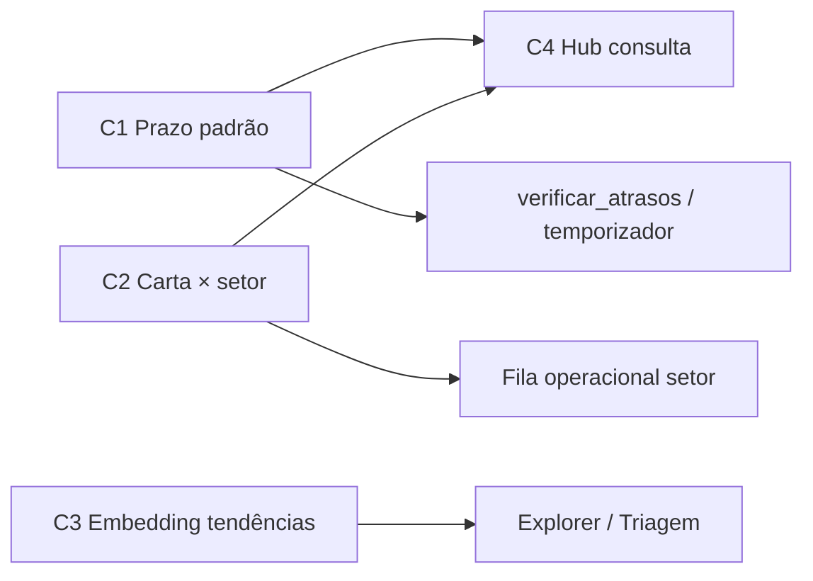

# Onda 3 — Carta otimizada, SLA e consulta por perfil

> **Documento de especificação** — ideias registradas em jun/2026.  
> Índice: [README.md](../README.md) · Roadmap: [ROADMAP_PRODUTO.md](../ROADMAP_PRODUTO.md) · Carta (histórico): [arquivo/carta-otimizacao/](../arquivo/carta-otimizacao/)

Este arquivo detalha evoluções propostas para a **base otimizada da Carta de Serviços**, o **cálculo de prazo (SLA)** e uma **nova experiência de consulta** orientada a vereador, protocolo e secretaria.

---

## Resumo das entregas propostas

| # | Entrega | Área | Status |
|---|---------|------|--------|
| **C1** | Prazo padrão + regra «serviço ou padrão» na carta otimizada | SLA / Carta | **Concluído** |
| **C2** | Vínculo carta → unidade administrativa (além do órgão Sinapse) | Carta / Tramitação | **Concluído** |
| **C3** | Embedding enriquecido ao incorporar tendências à carta | IA / Triagem | Pendente |
| **C4** | Página de consultas intuitivas por perfil (vereador, protocolo, secretaria) | Frontend / UX | **Concluído** |

---

## Contexto atual (baseline)

| Tema | Implementação hoje |
|------|-------------------|
| Carta Sinapse | Catálogo read-only via `integrations/sinapse_catalog.py`; sync em `SinapseSyncService` |
| Carta otimizada | `ServicoOtimizado` (`core/models_carta_otimizada.py`): `prazo_dias`, `embedding_otimizado`, `texto_rag_otimizado` |
| Explorer | `CartaExplorerView.vue` + API `/api/integrations/carta/` — busca, ficha, simulação de triagem |
| Prazo na demanda | `PrazoDemandaService` + snapshot `prazo_efetivo_dias`/`prazo_origem` ao protocolar; fallback via `ConfiguracaoCarta` |
| Alertas SLA | `verificar_atrasos` + `data_inicio_prazo` ao `PROTOCOLADO`; usa resolução centralizada (C1) |
| Unidade administrativa | `UnidadeAdministrativa` ligada a `sinapse_orgao_id`; demanda e tramitação já usam setor (`0046`+) |
| Tendências | `Tendencia` + promover à carta (`TendenciaService`); embedding em tendência parcial |
| Triagem | `TriagemService` + base otimizada; comandos `regenerar_embeddings_base_otimizada`, `otimizar_carta_llm` |

**Lacuna central:** prazo, setor e embedding da carta otimizada existem no modelo local, mas o **fluxo operacional** (SLA, despacho, triagem) ainda prioriza o catálogo Sinapse bruto e não consolida regras de gestão num único painel.

---

## C1 — Prazo padrão e regra «serviço ou padrão»

### Objetivo

Permitir que gestores definam um **prazo operacional padrão** (dias) e escolham, por política institucional, se o SLA de cada demanda usa o prazo do serviço (Sinapse / base otimizada) ou o padrão — com **fallback automático** para o padrão quando o serviço não tiver prazo registrado.

### Comportamento desejado

1. **Configuração singleton** (ou extensão de configuração existente), editável por **GESTOR**:
   - `prazo_padrao_dias` (ex.: 30)
   - `politica_prazo`: `SERVICO` | `PADRAO` | `SERVICO_COM_FALLBACK` (recomendado)

2. **Resolução do prazo efetivo** (função única, ex.: `resolver_prazo_demanda(demanda)`):

   | Política | Serviço com prazo | Serviço sem prazo |
   |----------|-------------------|-------------------|
   | `SERVICO` | prazo do serviço | `None` (sem SLA — status quo) |
   | `PADRAO` | prazo padrão | prazo padrão |
   | `SERVICO_COM_FALLBACK` | prazo do serviço | **prazo padrão** (fallback natural) |

3. **Ordem de leitura do prazo do serviço** (prioridade):
   1. `ServicoOtimizado.prazo_dias` (se ativo e preenchido)
   2. `sinapse_catalog.parse_prazo_dias(servico.prazo)` (Sinapse)
   3. Metadados ricos (`CartaServicoMetadata.prazo_dias_numericos`) se disponível

4. **Consumidores** devem usar a mesma função:
   - `Demanda.prazo_dias()` (modelo)
   - `verificar_atrasos`
   - Dashboards / temporizador na fila protocolo
   - Explorer e ficha do serviço (exibir prazo **efetivo** + origem: «carta», «sinapse», «padrão»)

5. **Auditoria:** campo calculado ou persistido `prazo_origem` (`SERVICO` | `PADRAO` | `INDEFINIDO`) opcional na demanda ao protocolar.

### Escopo técnico sugerido

| Camada | Ação |
|--------|------|
| Modelo | `ConfiguracaoCarta` ou campos em config existente; migração |
| Serviço | `core/services/prazo_demanda_service.py` — resolução centralizada |
| Integração | Ajustar `sinapse_catalog.prazo_dias` callers para serviço unificado |
| Admin / API | `GET`/`PATCH` config; serializer + testes |
| Frontend | Seção em gestão (Gestor) ou aba no Explorer administrativo |

### Critérios de aceite

- [x] Gestor altera `prazo_padrao_dias` e política → próxima demanda protocolada reflete SLA correto.
- [x] Serviço sem prazo + `SERVICO_COM_FALLBACK` → usa padrão; temporizador e `verificar_atrasos` consistentes.
- [x] Ficha do serviço no Explorer indica origem do prazo exibido.
- [x] Testes unitários cobrem matriz política × presença/ausência de prazo.

**Evidência (jun/2026):** migração `0057`, API `GET/PATCH /api/configuracao-carta/`, tela `/admin/configuracao-carta`, `core.tests.test_prazo_demanda_service` (6 testes OK com `--keepdb`).

### Riscos e mitigações

| Risco | Mitigação |
|-------|-----------|
| Prazo Sinapse diverge do otimizado | Prioridade explícita na função de resolução; documentar no Explorer |
| Demandas antigas sem `prazo_origem` | Recalcular on-read; não reabrir histórico fechado |
| Gestor usa `PADRAO` e ignora carta | Política default homologação: `SERVICO_COM_FALLBACK` |

---

## C2 — Vínculo carta → unidade administrativa

### Objetivo

Além do **órgão Sinapse** (`sinapse_orgao_id` derivado do serviço), permitir vincular cada serviço da carta otimizada a uma **unidade administrativa (setor)** local — para despacho automático, filas operacionais e indicadores por setor.

### Comportamento desejado

1. Campo opcional em `ServicoOtimizado` (ou tabela de mapeamento N:1):
   - `unidade_administrativa` → FK `UnidadeAdministrativa`
   - Validação: `unidade.sinapse_orgao_id` deve coincidir com órgão do serviço (ou exigir confirmação gestor se divergir)

2. **Prioridade no despacho automático** (fluxo protocolo / AUTO):
   1. Unidade definida na carta otimizada
   2. Regra de fluxo por serviço (`FluxoProtocolo`) se existir
   3. Fallback: primeira unidade ativa do órgão ou fila genérica do órgão

3. **Gestão:**
   - Painel Gestor/Protocolo: editar vínculo serviço ↔ setor (lista filtrável por órgão)
   - Import opcional: sugerir setor a partir de histórico de tramitações (fase posterior)

4. **Exibição:**
   - Explorer: ficha com órgão **e** setor sugerido
   - DemandaDetail / fila secretaria: setor já reflete vínculo ao protocolar

### Escopo técnico sugerido

| Camada | Ação |
|--------|------|
| Modelo | FK `unidade_administrativa` em `ServicoOtimizado`; migração |
| API | CRUD parcial no endpoint carta otimizada / gestão |
| Serviços | `FluxoProtocolo`, `ClusterService`, despacho protocolo — ler vínculo |
| Frontend | Coluna + editor em `CartaExplorerView` ou tela dedicada «Mapeamento carta-setor» |
| Testes | Validação órgão × unidade; despacho AUTO com setor |

### Critérios de aceite

- [x] Serviço com unidade vinculada → demanda protocolada entra na fila `minha_unidade` correta.
- [x] Serviço sem unidade → fallback para primeira unidade ativa do órgão (ou sem setor se órgão não tiver unidades).
- [x] API rejeita unidade de outro órgão (400 + mensagem clara).

**Evidência (jun/2026):** migração `0058`, `CartaSetorService`, API `POST /api/carta-setores/upsert/`, coluna setor em `/gestao-fluxo-servicos`, `core.tests.test_carta_setor` (8 testes OK).

### Riscos e mitigações

| Risco | Mitigação |
|-------|-----------|
| Setor desativado com vínculo antigo | Bloquear desativação ou limpar vínculos; alerta no Explorer |
| Sinapse troca órgão do serviço | Job reconciliação pós-sync; flag `precisa_revisao` |

---

## C3 — Embedding enriquecido com tendências incorporadas

### Objetivo

Melhorar a **qualidade semântica** do embedding de serviços na base otimizada quando **tendências** forem promovidas à carta ou consolidadas — incorporando linguagem real dos cidadãos/vereadores sem poluir o texto institucional exibido ao usuário.

### Comportamento desejado

1. **Gatilho:** ao `TendenciaService.promover_a_carta()` (ou ação equivalente):
   - Coletar amostra de relatos (`TendenciaOcorrencia`, demandas vinculadas)
   - Gerar/atualizar `palavras_chave`, `problemas_resolve` e bloco auxiliar **somente para RAG** (não substituir `descricao_objetiva` institucional)

2. **Pipeline de texto RAG** (`texto_rag_otimizado`):
   - Seções estruturadas: título, intenção, problemas, **sinônimos de tendência** (top N termos/frequências)
   - Limite de tokens configurável; deduplicação

3. **Regeneração de embedding:**
   - Reutilizar `AIKernelClient` / `regenerar_embeddings_base_otimizada`
   - Versionar `versao_otimizacao`; log em `EstatisticasBaseOtimizada`

4. **Modo assistivo:** triagem continua sugerindo; operador valida; métricas antes/depois no sandbox Explorer (`simular-triagem`)

5. **Tendências ainda não promovidas:** opcionalmente alimentar índice separado «malha fina» sem alterar carta até promoção.

### Escopo técnico sugerido

| Camada | Ação |
|--------|------|
| Serviço | `enriquecer_servico_com_tendencia(servico_id, tendencia_id)` |
| Comando | Estender `otimizar_carta_llm` ou novo `incorporar_tendencias_embedding` |
| Modelo | Campo JSON `sinonimos_tendencia` ou reuse `palavras_chave` com proveniência |
| Testes | Promover tendência → embedding muda; simulação triagem melhora score em casos fixture |
| Observabilidade | Comparar score médio sandbox pré/pós em amostra homologação |

### Critérios de aceite

- [ ] Promoção tendência → carta dispara rebuild RAG + embedding assíncrono (ou comando batch documentado).
- [ ] Texto exibido ao cidadão/vereador na ficha **não** inclui jargão bruto das ocorrências.
- [ ] Sandbox registra latência e top candidatos reprodutíveis em teste.

### Riscos e mitigações

| Risco | Mitigação |
|-------|-----------|
| Ruído semântico (termos ofensivos/PII) | Sanitizar relatos; lista blocklist; revisão humana `validado_humano` |
| Drift entre Sinapse e otimizado | Embedding só na base otimizada; Sinapse permanece read-only |
| Custo Kernel | Batch + Celery (E2 roadmap); limite de ocorrências por tendência |

---

## C4 — Página de consultas intuitivas por perfil

### Objetivo

Criar uma **página única de entrada** (ou hub com abas por perfil) para consultas frequentes — reduzindo dependência de menus dispersos (`DemandasView`, filas protocolo, Explorer, setores).

### Princípios UX

- Linguagem **operacional**, não técnica («Meus ofícios», «O que vence esta semana», «Serviços da minha secretaria»).
- **Busca unificada** (texto + filtros rápidos) com resultados agrupados por tipo.
- Respeitar **RBAC** existente (`VEREADOR`, `PROTOCOLO`, `SECRETARIA`, `GESTOR`).

### Escopo por perfil (v1)

| Perfil | Consultas principais |
|--------|----------------------|
| **Vereador** | Meus rascunhos; enviados aguardando protocolo; com prazo crítico; busca por endereço/assunto; atalho «novo ofício» |
| **Protocolo** | Fila protocolados; operacionais; devolutivas; tendências abertas; busca por protocolo/ofício/vereador |
| **Secretaria** | Fila `minha_unidade`; Super OS líder; vencendo/atrasados (SLA); busca por bairro/serviço |
| **Gestor** | Atalhos para Explorer, tendências, config ofício, KPIs trilha (quando E4/P4 existir) |

### Comportamento desejado

1. Rota sugerida: `/consulta` ou `/hub` — item de menu destacado por perfil.
2. Campo de busca global com debounce; chips de filtro contextuais.
3. Cards de **atalho** (contagens em tempo real via APIs existentes — evitar endpoint monolítico na v1).
4. Resultados: tabela compacta + link para `DemandaDetail` / ficha carta / tendência.
5. Mobile: layout responsivo (reutilizar padrão P13 — scroll horizontal em tabelas).

### Escopo técnico sugerido

| Camada | Ação |
|--------|------|
| Frontend | `ConsultaHubView.vue`; rotas + `AppMenu.vue` por perfil |
| Backend | Opcional v1: compor respostas de endpoints existentes; v2: `GET /api/consulta/hub/` agregador |
| API reuse | `demandas/` filtros, filas protocolo, `carta/servicos/`, `tendencias/`, contadores dashboard |
| Testes | E2E por perfil (H1); smoke build + lint |

### Critérios de aceite

- [x] Vereador encontra rascunho e ofício enviado em ≤ 2 cliques a partir do hub.
- [x] Secretaria vê fila do setor e demandas vencendo sem abrir menu lateral profundo.
- [x] Protocolo acessa filas críticas e busca por protocolo global.
- [x] Usuário sem permissão não vê cards de outro perfil (403 ou ocultação).

**Evidência (jun/2026):** `/consulta` + `GET /api/consulta/hub/` + `GET /api/consulta/busca/` + `core.tests.test_consulta_hub` + `npm run build`.

### Riscos e mitigações

| Risco | Mitigação |
|-------|-----------|
| Duplicar lógica de filas | v1 só agrega URLs/filtros; não reimplementar queryset |
| Performance (N+1 contadores) | Cache curto ou endpoint agregador na v2 |
| Menu já cheio | Substituir entradas redundantes, não empilhar |

---

## Dependências entre entregas

**Ordem sugerida de implementação:** C1 → C2 → C4 → **C6 → C5** (concluídos jun/2026). Próximo: **C3** (embedding tendências). Detalhes C5/C6: [carta-assuntos-utilizacao-unidades.md](carta-assuntos-utilizacao-unidades.md) · runbook RM: [importacao-unidades-rm271698.md](../operacao/importacao-unidades-rm271698.md).

---

## Evidências de pronto (homologação)

Alinhado a [homologacao-readiness](../operacao/homologacao-go-live.md):

| Entrega | Backend | Frontend |
|---------|---------|----------|
| C1 | `manage.py test` + casos prazo | Build + tela config |
| C2 | Testes despacho + validação FK | Explorer/mapeamento |
| C3 | Testes embedding + comando batch | Sandbox comparativo |
| C4 | Smoke APIs reutilizadas | `npm run build` + E2E perfis |

---

## Referências de código

| Arquivo | Relação |
|---------|---------|
| `backend/core/models_carta_otimizada.py` | `ServicoOtimizado`, prazo, embedding |
| `backend/integrations/sinapse_catalog.py` | `parse_prazo_dias`, `prazo_dias` |
| `backend/core/models.py` | `Demanda.prazo_dias()`, `unidade_administrativa` |
| `backend/core/management/commands/verificar_atrasos.py` | SLA batch |
| `backend/core/models_unidade_administrativa.py` | Setores |
| `backend/core/services/tendencia_service.py` | Promoção à carta |
| `backend/core/services/carta_sinapse_sync.py` | Sync metadados prazo |
| `frontend/src/views/CartaExplorerView.vue` | Explorer atual |
| `frontend/src/views/SetoresView.vue` | Cadastro setores |
