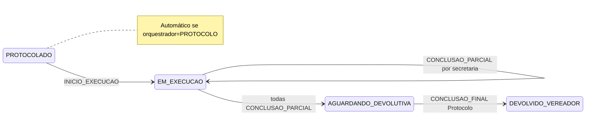
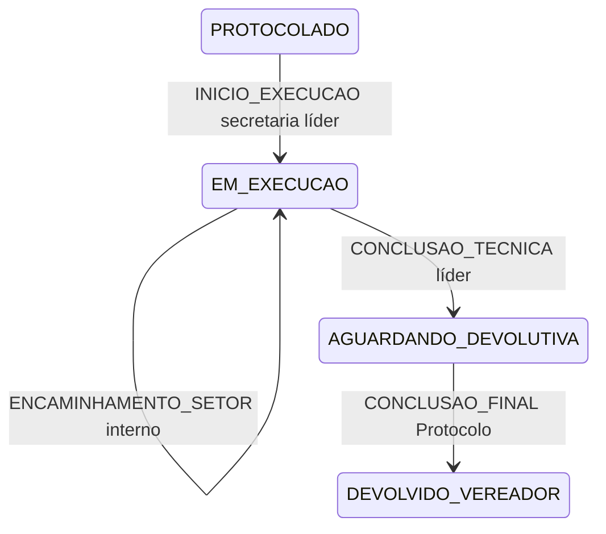

# Fluxo de tramitações — Cenários 1 a 5

> **Status:** especificação aprovada para implementação (jun/2026)  
> Diagrama: [SGDL-fluxo_tramitacoes.png](../SGDL-fluxo_tramitacoes.png)  
> Índice operacional: [gestao-operacional-portal-vereadores.md](./gestao-operacional-portal-vereadores.md)

Este documento mapeia os **cinco perfis de processo** do diagrama de produto para estados, eventos, RBAC e campos persistidos no SGDL.

---

## 1. Regra invariante

```text
1 Demanda (processo principal)
    └── Despacho de origem (Protocolo)
            └── N pernas transversais (ilimitadas; órgão × setor)
                    └── GATE conclusão final: só avança quando TODAS as pernas
                        registrarem conclusão parcial (independente da ordem)
```

- **Conclusão parcial** = encerramento operacional do **setor/órgão da secretaria** que registra (paralelo entre secretarias).
- **Conclusão final** = Protocolo, após **todas** as conclusões parciais (se a secretaria líder for a última, o sistema consolida automaticamente).

- **Transversal** = execução paralela em 2+ secretarias (ou N setores).
- **Direto** = execução na secretaria líder, com roteamento interno entre setores.
- **Cluster Super OS** = agrupamento de ofícios de **vários vereadores** (mesmo serviço/geo); não confundir com multi-órgão B5 (mesmo vereador, várias secretarias).

> **Evolução de modelo (fase D2):** substituir clones `-D2` por entidade `PernaOperacional` na demanda única. Até lá, clones permanecem como implementação B5 com projeção de perfil nos campos abaixo.

---

## 2. Eixos de classificação

| Eixo | Campo / constante | Valores |
|------|-------------------|---------|
| Entrada | `Demanda.modo_entrada_processo` | `OFICIO_UNICO` · `CLUSTER_SUPER_OS` |
| Roteamento | `Demanda.fluxo_roteamento` | `FLUXO_DIRETO` · `FLUXO_TRANSVERSAL` |
| Orquestração | `Demanda.orquestrador_conclusao` | `SECRETARIA_LIDER` · `PROTOCOLO` |
| Início execução | `Demanda.inicio_execucao_automatico` | `true` · `false` |
| Perfil derivado | `PerfilProcesso.resolver(...)` | `CENARIO_1` … `CENARIO_5` |

Constantes: `core/models_operacional.py`  
Resolução: `OperacionalEstadoService.resolver_perfil_processo()`

### 2.1 Matriz cenário → eixos

| Cenário | Entrada | `fluxo_roteamento` | `orquestrador_conclusao` | `inicio_execucao_automatico` |
|---------|---------|--------------------|---------------------------|------------------------------|
| **1** Cluster + líder | `CLUSTER_SUPER_OS` | `FLUXO_TRANSVERSAL` | `SECRETARIA_LIDER` | `false` |
| **2** Ofício único + líder | `OFICIO_UNICO` | `FLUXO_TRANSVERSAL` | `SECRETARIA_LIDER` | `false` |
| **3** Ofício único + Protocolo | `OFICIO_UNICO` | `FLUXO_TRANSVERSAL` | `PROTOCOLO` | `true` |
| **4** Direto + líder | `OFICIO_UNICO` | `FLUXO_DIRETO` | `SECRETARIA_LIDER` | `false` |
| **5** Cluster + Protocolo | `CLUSTER_SUPER_OS` | `FLUXO_TRANSVERSAL` | `PROTOCOLO` | `true` |

### 2.2 Definição na triagem (despacho)

Gravado em `aplicar_triagem_protocolo` + `definir_perfil_processo_no_despacho`:

| Condição | Resultado |
|----------|-----------|
| `total_destinos == 1` | `FLUXO_DIRETO` → **Cenário 4** |
| `total_destinos > 1` | `FLUXO_TRANSVERSAL` |
| Cluster Super OS ativo ou ≥2 autores no cluster | `modo_entrada_processo = CLUSTER_SUPER_OS` |
| Caso contrário | `modo_entrada_processo = OFICIO_UNICO` |
| Payload `orquestrador_conclusao=PROTOCOLO` | Força orquestração Protocolo |
| Despacho `automatico=true` **e** transversal | `orquestrador_conclusao=PROTOCOLO`, início automático |
| Demais transversais manuais | `orquestrador_conclusao=SECRETARIA_LIDER` |
| Fluxo direto | Sempre `SECRETARIA_LIDER`, sem início automático |

---

## 3. Máquina de estados por cenário

Estados comuns: `AGUARDANDO_PROTOCOLO` → `PROTOCOLADO` → `EM_EXECUCAO` → `AGUARDANDO_DEVOLUTIVA_PROTOCOLO` → `DEVOLVIDO_VEREADOR` → `FINALIZADO`.

### Faixa transversal (C1, C2, C3, C5)



**Gate:** `conclusoes_parciais_pendentes(lider)` vazio → consolidação → `AGUARDANDO_DEVOLUTIVA_PROTOCOLO`.

### Fluxo direto (C4)



---

## 4. Eventos e tramitações por fase

| Fase | Evento (`Tramitacao.tipo`) | Quem | Cenários |
|------|----------------------------|------|----------|
| Entrada | `ENVIO_OFICIAL` | Vereador | todos |
| Triagem | `TRIAGEM_PROTOCOLO` | Protocolo | todos |
| Despacho | `DESPACHO` | Protocolo | todos |
| Início | `STATUS_UPDATE` (`INICIO_EXECUCAO`) | Líder **ou** automático | todos |
| Andamento | `EXECUCAO`, `ENCAMINHAMENTO_SETOR`, `COMENTARIO` | Secretarias | todos |
| Conclusão parcial | `CONCLUSAO_PARCIAL` | Cada órgão transversal | C1–C3, C5 |
| Consolidação | `CONCLUSAO_TECNICA` (`consolidacao_transversal=true`) | Sistema / última parcial | C1–C3, C5 |
| Conclusão técnica | `CONCLUSAO_TECNICA` | Secretaria líder | C4 |
| Devolução | `DEVOLUCAO` | Secretaria | todos |
| Conclusão final | `CONCLUSAO_FINAL` | Protocolo | todos |
| Devolutiva | `DEVOLUTIVA_PROTOCOLO` / encerramento | Vereador / Protocolo | todos |

### Metadata `TRIAGEM_PROTOCOLO`

```json
{
  "acao": "DESPACHO_MANUAL",
  "tipo_entrada": "CARTA_SERVICO",
  "fluxo_roteamento": "FLUXO_TRANSVERSAL",
  "modo_entrada_processo": "OFICIO_UNICO",
  "orquestrador_conclusao": "SECRETARIA_LIDER",
  "perfil_processo": "CENARIO_2",
  "inicio_execucao_automatico": false,
  "total_destinos": 3,
  "destinos": [{"secretaria_id": 1, "unidade_administrativa_id": 10}]
}
```

---

## 5. RBAC por cenário

Legenda: ✅ permitido · — não aplicável · 🔒 bloqueado

### C1 — Cluster, Secretaria líder orquestra

| Ação | Vereador | Protocolo | Sec. líder | Sec. secundária |
|------|----------|-----------|------------|-----------------|
| Despacho Super OS | — | ✅ | — | — |
| Iniciar execução | — | — | ✅ | — |
| Andamentos / encaminhamentos | — | — | ✅ | ✅ (sua perna) |
| Conclusão parcial | — | — | ✅ | ✅ |
| Conclusão técnica direta | — | — | 🔒 | 🔒 |
| Conclusão final | — | ✅ | — | — |

### C2 — Ofício único transversal, líder orquestra

Igual C1, sem Super OS multi-vereador; um único vereador na devolutiva.

### C3 — Ofício único transversal, Protocolo orquestra

| Ação | Vereador | Protocolo | Sec. líder | Sec. secundária |
|------|----------|-----------|------------|-----------------|
| Iniciar execução | — | — (automático) | — | — |
| Andamentos | — | 👁 monitora | ✅ | ✅ |
| Conclusão parcial | — | — | ✅ | ✅ |
| Conclusão final | — | ✅ (após gate) | — | — |

### C4 — Fluxo direto

| Ação | Vereador | Protocolo | Sec. líder |
|------|----------|-----------|------------|
| Iniciar execução | — | — | ✅ |
| Conclusão técnica | — | — | ✅ |
| Conclusão parcial | — | — | 🔒 |
| Conclusão final | — | ✅ | — |

### C5 — Cluster transversal, Protocolo orquestra

Combina Super OS (C1) com início automático e conclusão conduzida pelo Protocolo (C3).

---

## 6. Diferença de orquestração (líder vs Protocolo)

| Aspecto | `SECRETARIA_LIDER` (C1, C2, C4) | `PROTOCOLO` (C3, C5) |
|---------|----------------------------------|----------------------|
| Início execução | Manual — ação `iniciar_execucao` na demanda líder | Automático no despacho |
| Quem “puxa” operação | Secretaria competente / líder | Protocolo (via flag + automação) |
| Gate transversal | Igual: todas `CONCLUSAO_PARCIAL` | Igual |
| Consolidação pós-gate | Evento `CONCLUSAO_TECNICA` consolidado | Idem |
| Conclusão final | Sempre Protocolo + assinatura dupla | Idem |

---

## 7. API

### Despacho manual — parâmetro opcional

```http
POST /api/demandas/{id}/despachar/
{
  "destinos": [...],
  "orquestrador_conclusao": "PROTOCOLO"
}
```

Valores: `SECRETARIA_LIDER` (padrão) · `PROTOCOLO`.

### Estado operacional — campos adicionais

`GET /api/demandas/{id}/operacional/estado/` passa a incluir:

```json
{
  "modo_entrada_processo": "OFICIO_UNICO",
  "orquestrador_conclusao": "SECRETARIA_LIDER",
  "perfil_processo": "CENARIO_2",
  "inicio_execucao_automatico": false
}
```

### Ação futura: `POST …/operacional/iniciar-execucao/`

Exclusiva cenários **C1, C2, C4** (`orquestrador_conclusao=SECRETARIA_LIDER`, status `PROTOCOLADO`).

---

## 8. Roadmap de implementação

| Fase | Entrega | Status |
|------|---------|--------|
| **P0** | Campos + resolver perfil + spec (este doc) | ✅ |
| **P1** | Início automático C3/C5; endpoint `iniciar-execucao` C1/C2/C4 | em andamento |
| **P2** | Formulário H3-17 multi-setor → N pernas | ✅ |
| **P3** | `PernaOperacional` — 1 demanda, fim dos clones B5 | ✅ |
| **P4** | Timeline unificada por perna na UI | ✅ (parcial) |

---

## 10. Modelo `PernaOperacional` (P3)

```text
PernaOperacional
  demanda_id              → FK Demanda (processo único)
  sinapse_orgao_id        → órgão responsável
  unidade_administrativa  → setor (nullable)
  status                  → PENDENTE | EM_EXECUCAO | CONCLUIDA | CANCELADA
  ordem                   → ordem no despacho
  despacho_tramitacao_id  → FK Tramitacao DESPACHO origem
  conclusao_tramitacao_id → FK Tramitacao CONCLUSAO_PARCIAL
```

Migration: `0067_perna_operacional`  
Serviço: `core/services/perna_operacional_service.py`

Despacho multi-órgão **não cria mais clones** `-D2`; todas as pernas ficam na demanda principal.  
Clusters **Super OS multi-vereador** permanecem com demandas distintas por vereador (C1/C5).

---

| Arquivo | Papel |
|---------|-------|
| `core/models_operacional.py` | `ModoEntradaProcesso`, `OrquestradorConclusao`, `PerfilProcesso` |
| `core/models.py` | Campos em `Demanda` |
| `core/services/operacional_estado_service.py` | Resolução, triagem, início execução |
| `core/services/demanda_despacho_service.py` | Grava perfil no despacho |
| `frontend/src/constants/operacionalEstado.js` | Rótulos UI |
