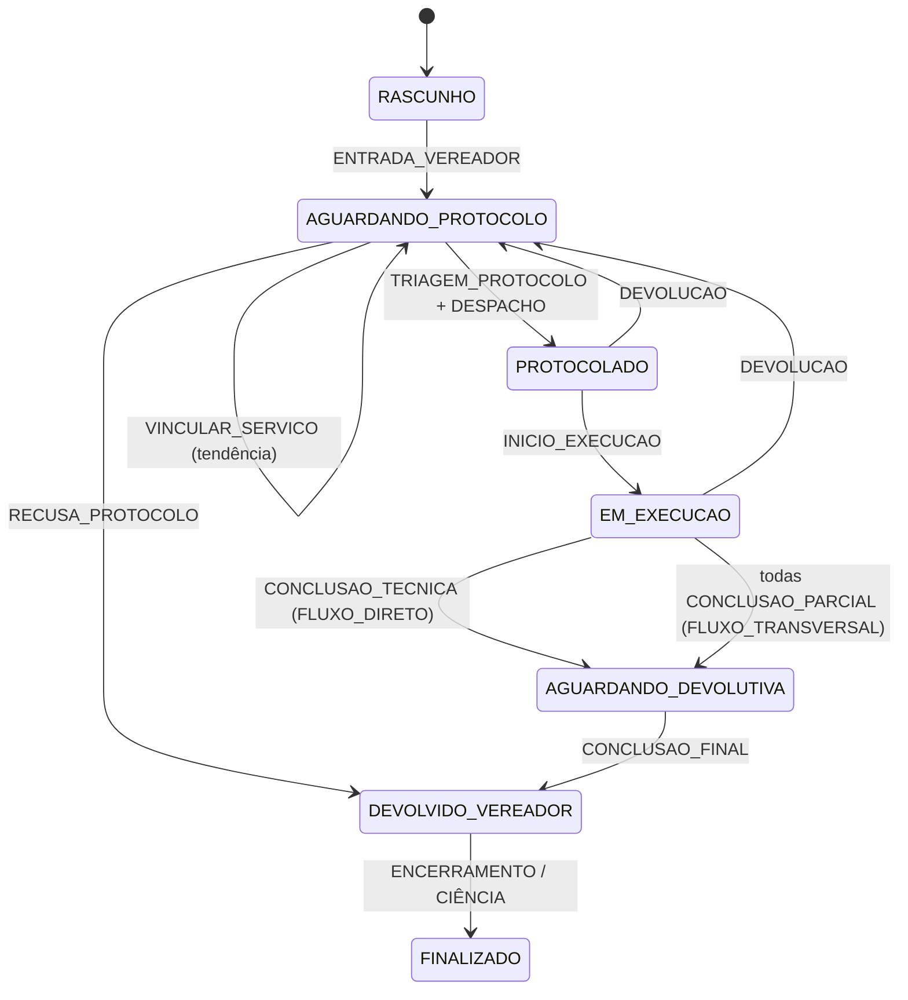

# Gestão Operacional — Portal dos Vereadores

> **Status:** implementado (backend Fase 1 + Fase 2 — jun/2026)  
> Índice: [README.md](../README.md) · Perfis: [modulo-usuarios-perfis.md](./modulo-usuarios-perfis.md)

Este documento descreve o fluxo operacional do SGDL para demandas originadas no **Portal dos Vereadores**, a máquina de estados, eventos, RBAC e os endpoints da API.

---

## 1. Visão geral

O SGDL trata cada demanda como um **processo operacional** com:

| Camada | Implementação |
|--------|----------------|
| **Projeção de estado** | `Demanda.status`, `Demanda.fluxo_roteamento`, `Demanda.sinapse_orgao_lider_id`, `Demanda.modo_entrada_processo`, `Demanda.orquestrador_conclusao` |
| **Log de eventos** | `Tramitacao` (`tipo` + `metadata` JSON) |
| **Assinatura eletrônica** | `AssinaturaEletronica` / `AssinaturaPendingAcao` por etapa |

Constantes de domínio: `core/models_operacional.py`  
Validadores e mutações: `core/services/operacional_estado_service.py`  
RBAC: `core/services/operacional_permissions.py`  
API dedicada: `core/views_operacional.py`

---

## 2. Classificação na entrada

Ao **enviar oficialmente** (`EnvioOficialService`), a demanda vai para `AGUARDANDO_PROTOCOLO` e registra o evento `ENVIO_OFICIAL`.

| Trilha | Critério | Comportamento |
|--------|----------|---------------|
| **Carta de Serviço** | `origem_vinculo = CARTA` e `sinapse_servico_id` preenchido | Secretaria competente conhecida via catálogo Sinapse |
| **Tendência** | `origem_vinculo = TENDENCIA` ou `tendencia_id` | Sem vínculo carta; Protocolo tria manualmente |

Despacho automático (`FluxoProtocoloService`) **não se aplica** à trilha tendência.

---

## 3. Máquina de estados



> `AGUARDANDO_DEVOLUTIVA` = alias semântico `AGUARDANDO_CONCLUSAO_FINAL` (conclusão técnica consolidada, aguardando Protocolo).

### 3.1 Roteamento na triagem (Protocolo)

Evento: `TRIAGEM_PROTOCOLO` — emitido no despacho (`DemandaDespachoService.despachar_multiplo`).

| Modo | Condição | Regra |
|------|----------|-------|
| `FLUXO_DIRETO` | 1 secretaria de destino | Secretaria líder = órgão competente da carta |
| `FLUXO_TRANSVERSAL` | 2+ secretarias | Líder permanece no órgão da carta; demais viram desdobramentos no cluster |

Campos gravados: `fluxo_roteamento`, `sinapse_orgao_lider_id`, `modo_entrada_processo`, `orquestrador_conclusao`, `inicio_execucao_automatico`.

> **Cenários 1–5:** matriz completa em [fluxo-tramitacoes-cenarios.md](./fluxo-tramitacoes-cenarios.md) (diagrama [SGDL-fluxo_tramitacoes.png](../SGDL-fluxo_tramitacoes.png)).

### 3.2 Triagem de tendências

| Ação | Endpoint | Resultado |
|------|----------|-----------|
| **(A) Vincular serviço** | `POST …/operacional/vincular-servico/` | Associa serviço Sinapse; converte trilha para carta |
| **(B) Despacho manual** | `POST …/demandas/{id}/despachar/` | Fluxo existente com multi-destino |
| **(C) Recusa ao vereador** | `POST …/operacional/recusa-protocolo/` | `DEVOLVIDO_VEREADOR` + `RECUSA_PROTOCOLO` |

---

## 4. Gestão e tramitação (Secretarias)

### FLUXO_DIRETO

- Apenas a **secretaria líder** (`sinapse_orgao_lider_id`) emite `CONCLUSAO_TECNICA`.
- Status → `AGUARDANDO_DEVOLUTIVA_PROTOCOLO`.
- Exige assinatura eletrônica da chefia (`ETAPA_CONCLUSAO_SECRETARIA`).

### FLUXO_TRANSVERSAL

- **Bloqueia** conclusão geral por secretaria individual.
- Cada órgão integrado emite `CONCLUSAO_PARCIAL` na **sua** demanda (líder ou clone).
- Quando **todas** concluem, a demanda líder avança para `AGUARDANDO_DEVOLUTIVA_PROTOCOLO`.
- `solicitar-devolutiva` legado **rejeita** fluxo transversal — usar `conclusao-parcial`.

### DEVOLUCAO

- Secretaria devolve ao Protocolo com justificativa (mín. 10 caracteres).
- Status → `AGUARDANDO_PROTOCOLO`; limpa `fluxo_roteamento` (exige novo roteamento).

---

## 5. Conclusão final (Protocolo)

- **Exclusivo** perfil `PROTOCOLO`.
- Pré-requisito: histórico técnico completo (`compilar_historico_tecnico`).
- Payload inclui pareceres consolidados para exibição no frontend.
- Assinatura eletrônica: etapa `CONCLUSAO_FINAL` (operador + gestor do Protocolo).
- Status → `DEVOLVIDO_VEREADOR`.

---

## 6. RBAC (matriz resumida)

| Evento | VEREADOR | PROTOCOLO | SECRETARIA | GESTOR |
|--------|----------|-----------|------------|--------|
| ENTRADA_VEREADOR | ✅ autor | — | — | ✅ |
| TRIAGEM / DESPACHO | — | ✅ | — | — |
| RECUSA_PROTOCOLO | — | ✅ | — | — |
| VINCULAR_SERVICO | — | ✅ | — | — |
| INICIO_EXECUCAO | — | — | ✅ órgão destino | — |
| CONCLUSAO_TECNICA | — | — | ✅ líder (direto) | — |
| CONCLUSAO_PARCIAL | — | — | ✅ órgão (transversal) | — |
| DEVOLUCAO | — | — | ✅ órgão responsável | — |
| CONCLUSAO_FINAL | — | ✅ | — | — |

Protocolo **não** emite parecer técnico de Secretaria. Secretaria **não** faz roteamento inicial/final.

---

## 7. Eventos e tipos de tramitação

| Evento | `Tramitacao.tipo` | `metadata` principal |
|--------|-------------------|----------------------|
| Entrada vereador | `ENVIO_OFICIAL` | — |
| Triagem | `TRIAGEM_PROTOCOLO` | `fluxo_roteamento`, `destinos`, `tipo_entrada` |
| Despacho | `DESPACHO` | — |
| Recusa | `RECUSA_PROTOCOLO` | `parecer` |
| Conclusão técnica | `CONCLUSAO_TECNICA` | `parecer` |
| Conclusão parcial | `CONCLUSAO_PARCIAL` | `parecer`, `sinapse_orgao_id` |
| Devolução | `DEVOLUCAO` | `justificativa`, `status_anterior` |
| Conclusão final | `CONCLUSAO_FINAL` | `parecer`, `historico_tecnico` |
| Devolutiva ao vereador | `DEVOLUTIVA_PROTOCOLO` | (legado, mantido) |

---

## 8. API — Endpoints operacionais (Fase 2)

Base: `/api/demandas/{id}/operacional/`

| Método | Rota | Perfil | Descrição |
|--------|------|--------|-----------|
| GET | `estado/` | autenticado | Estado, timeline, pendências e ações disponíveis |
| GET | `historico-tecnico/` | autenticado | Payload consolidado para conclusão final |
| POST | `vincular-servico/` | PROTOCOLO | (A) Vincula serviço Sinapse em tendência |
| POST | `recusa-protocolo/` | PROTOCOLO | (C) Recusa com parecer ao vereador |
| POST | `conclusao-parcial/` | SECRETARIA | Conclusão parcial (transversal) |
| POST | `iniciar-execucao/` | SECRETARIA | Início manual (C1, C2, C4) |
| POST | `conclusao-tecnica/` | SECRETARIA | Conclusão técnica + assinatura (direto) |
| POST | `devolver-protocolo/` | SECRETARIA | Devolução para re-roteamento |
| POST | `preview-conclusao-final/` | PROTOCOLO | Prévia hash assinatura conclusão final |
| POST | `conclusao-final/` | PROTOCOLO | Conclusão final assinada ao vereador |

### Exemplos

**Estado operacional**

```http
GET /api/demandas/42/operacional/estado/
Authorization: Bearer …
```

**Conclusão parcial (transversal)**

```http
POST /api/demandas/42/operacional/conclusao-parcial/
Content-Type: application/json

{ "parecer_operacional": "Serviço executado no trecho B da via." }
```

**Conclusão final (Protocolo)**

```http
POST /api/demandas/42/operacional/preview-conclusao-final/
{ "parecer_resposta": "Encaminhamos consolidação técnica ao gabinete." }

POST /api/demandas/42/operacional/conclusao-final/
{
  "parecer_resposta": "Encaminhamos consolidação técnica ao gabinete.",
  "hash_documento": "…",
  "declaracao_operador": "ASSINO A CONCLUSAO FINAL",
  "gestor_protocolo_id": 5,
  "declaracao_gestor": "ASSINO COMO GESTOR DO PROTOCOLO"
}
```

---

## 9. Modelo de dados (campos novos)

```text
Demanda.fluxo_roteamento       # FLUXO_DIRETO | FLUXO_TRANSVERSAL | ""
Demanda.sinapse_orgao_lider_id # órgão líder do processo
Demanda.modo_entrada_processo  # OFICIO_UNICO | CLUSTER_SUPER_OS | ""
Demanda.orquestrador_conclusao # SECRETARIA_LIDER | PROTOCOLO | ""
Demanda.inicio_execucao_automatico # bool — C3/C5
Tramitacao.metadata            # JSON — payload do evento
```

Migration: `0064_operacional_portal_vereadores`, `0066_perfil_processo_operacional`  
Assinatura conclusão final: `0065_assinatura_conclusao_final`

---

## 10. Compatibilidade legado

Demandas **sem** `fluxo_roteamento` (anteriores à migração) continuam usando:

- `solicitar-devolutiva` / `despachar-devolutiva` em `DemandaViewSet`
- Validadores operacionais aplicados apenas quando `fluxo_roteamento` está preenchido

---

## 11. Frontend (Fase 3)

- `frontend/src/constants/operacionalEstado.js` — mapa de fluxos e eventos
- `frontend/src/components/demanda/OperacionalTimeline.vue` — timeline ramificada
- `frontend/src/views/DemandaDetailView.vue` — consome `GET …/operacional/estado/` e ações por perfil
- `frontend/src/service/ApiService.js` — métodos operacionais

---

## 12. Testes

```bash
source /var/www/sgdl/venv/bin/activate
cd /var/www/sgdl/backend
python manage.py test core.tests.test_operacional_estado core.tests.test_views_operacional
python manage.py check --deploy
```

---

## 13. Arquivos relacionados

| Arquivo | Papel |
|---------|-------|
| `core/models_operacional.py` | Constantes de eventos e fluxos |
| `core/services/operacional_estado_service.py` | Máquina de estados |
| `core/services/operacional_permissions.py` | RBAC |
| `core/services/demanda_despacho_service.py` | Triagem no despacho |
| `core/services/devolutiva_protocolo_service.py` | Integração devolutiva |
| `core/services/assinatura_eletronica_service.py` | Etapa `CONCLUSAO_FINAL` |
| `core/views_operacional.py` | Endpoints REST |
| `core/tests/test_operacional_estado.py` | Testes unitários serviço |
| `core/tests/test_views_operacional.py` | Testes API |
