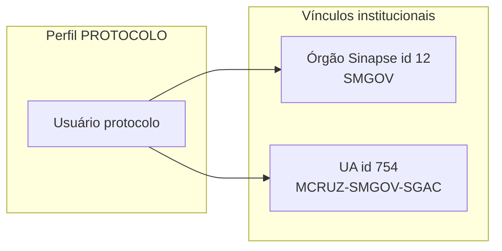
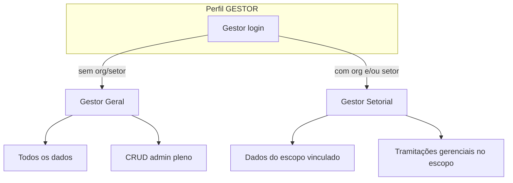

# Módulo de usuários — perfis, vínculos e governança

> **Status:** regras de negócio **acordadas e implementadas** (jun/2026).  
> Índice: [README.md](../README.md) · Roadmap: [ROADMAP_PRODUTO.md](../ROADMAP_PRODUTO.md)

Este documento consolida as **regras por perfil** no SGDL: quem é cada usuário, a que órgão/unidade deve estar vinculado e qual o alcance de permissões no frontend e no Django Admin.

---

## Princípio: Perfil + Atuação (Órgão › Setor)

Todo login no SGDL combina dois eixos:

| Eixo | O que define | Exemplo |
|------|----------------|---------|
| **Perfil** | Papel operacional — menus, permissões, filas disponíveis | `SECRETARIA`, `PROTOCOLO`, … |
| **Atuação** | **Onde** a pessoa opera no sistema — hierarquia **Órgão (Sinapse) › Setor (UA)** | Saúde › Divisão de Vigilância |

- **Órgão** = secretaria executiva no catálogo Sinapse (`Usuario.sinapse_orgao_id`).
- **Setor** = unidade administrativa importada do RM (`UnidadeAdministrativa` + `UnidadeAdministrativaResponsavel`).
- Setor **depende** do órgão — não são campos independentes.
- A API expõe isso em `atuacao_sgdl` (resumo `"Órgão › Setor"`, escopo textual, flag `completa`).

| Perfil | Atuação esperada |
|--------|------------------|
| **VEREADOR** | Sem órgão/setor — autor legislativo |
| **PROTOCOLO** | Fixo: órgão **12** (SMGOV) › UA **754** (SGAC) — aplicado automaticamente |
| **SECRETARIA** | Órgão + 1+ setor **obrigatórios** — fila «Meu setor» |
| **GESTOR** | Órgão/setor **definem o subtipo** — ver §2.4 (**Geral** vs **Setorial**) | Escopo de dados e CRUD |

A tela **Gestão de usuários** (`/gestao-usuarios`) organiza o cadastro em três blocos: **1. Perfil** → **2. Onde atua (Órgão › Setor)** → **3. Dados da conta**.

---

## 1. Modelo atual (código)

| Campo / entidade | Onde | Uso hoje |
|------------------|------|----------|
| `Usuario.perfil` | `core.models.Usuario` | `VEREADOR`, `PROTOCOLO`, `SECRETARIA`, `GESTOR` (+ `ASSESSOR` legado no enum) |
| `Usuario.sinapse_orgao_id` | idem | Órgão Sinapse (`catalog_orgao`); filtro de secretaria em listagens |
| `UnidadeAdministrativaResponsavel` | `models_unidade_administrativa` | Vínculo N:N usuário ↔ setor (fila `minha_unidade`) |
| `is_staff` / `is_superuser` | Django | Acesso ao **Django Admin** (`/admin/`) |

**Observação:** setores do usuário passam por `UnidadeAdministrativaResponsavel`. Gestão operacional: hub **`/gestao-usuarios`**; Django Admin complementar (U6 — inline setores + coluna «Onde atua»).

---

## 2. Regras por perfil (acordadas)

### 2.1 Vereador

| Aspecto | Regra |
|---------|--------|
| **Papel** | Usuário do **legislativo** — «nossos clientes»; autor de ofícios e demandas |
| **Vínculo órgão/unidade** | **Não exige** `sinapse_orgao_id` nem setor RM |
| **Conta** | **Usuário único** por vereador (1 login = 1 mandato/pessoa); assessores não compartilham login |
| **Escopo de dados** | Vê e opera **apenas suas demandas** (autor) |
| **Telas principais** | Copiloto, demandas, consulta, carta (consulta), perfil/assinatura |
| **Admin Django** | Não |

**Manter:** modelo de usuário único por vereador — sem multi-tenant por gabinete no mesmo login.

---

### 2.2 Protocolo

| Aspecto | Regra |
|---------|--------|
| **Papel** | **Protocolo Geral** — triagem, despacho, clusters, tendências, filas institucionais |
| **Vínculo órgão** | **Secretaria de Governo e Transparência** — `sinapse_orgao_id = **12**` |
| **Vínculo unidade** | **Seção de Gestão do Atendimento e Distribuição** — sigla `MCRUZ-SMGOV-SGAC` |
| **Referência RM** | `UnidadeAdministrativa` **id 754** · `sinapse_unidade_id = 110004543` (pós-import C6) |
| **Escopo** | Demandas de **todos os vereadores** em filas de protocolo; não restrito a um setor operacional de secretaria |
| **Telas principais** | Painéis protocolo, clusters, gestão tendências, consulta, setores (gestão), fluxo carta |
| **Admin Django** | Opcional `is_staff` para suporte; não obrigatório para operação diária |



> **Estado jun/2026:** vínculos aplicados automaticamente na criação/edição (`post_save`) e via `manage.py aplicar_vinculo_protocolo` para usuários existentes.

---

### 2.3 Secretaria

| Aspecto | Regra |
|---------|--------|
| **Papel** | Operador da **secretaria executiva** e do **setor** que executa/tramita demandas |
| **Vínculo órgão** | **Obrigatório:** `sinapse_orgao_id` = secretaria Sinapse responsável (ex.: Saúde `3`, Obras `13`, …) |
| **Vínculo unidade** | **Obrigatório gerenciar:** um ou mais setores via `UnidadeAdministrativaResponsavel` (tela **Setores → Resp.** ou API) |
| **Escopo** | Fila `minha_unidade` + demandas do órgão; dashboard e consulta filtrados |
| **Telas principais** | Demandas operacionais, encaminhar setor, devolutiva, consulta, setores (leitura/gestão conforme perfil) |
| **Admin Django** | Não |

**Gerenciamento esperado (U3):**

- Ao criar/editar usuário secretaria: escolher **órgão** + **setor(es)** da base RM (1 120 UAs).
- Múltiplos responsáveis no mesmo setor permitidos; usuário pode ter **vários setores** se atuar em mais de uma UA.

---

### 2.4 Gestor — Geral vs Setorial

O perfil `GESTOR` mantém **um único login** no enum; o **subtipo operacional** deriva dos vínculos institucionais (órgão Sinapse + setor(es) UA). Decisão de produto **jun/2026** (H3-16 / H3-28).

| Subtipo | Vínculo órgão/setor | Escopo de **dados** | Permissões |
|---------|---------------------|---------------------|------------|
| **Gestor Geral** | **Nenhum** (`sinapse_orgao_id` nulo e sem UA responsável) | **Todo o sistema** — todas secretarias, demandas, clusters, relatórios e configurações | **CRUD administrativo pleno**: Django Admin (`is_staff` + `is_superuser`), gestão de usuários, carta, FAQ, import RM, fluxo, reconciliação |
| **Gestor Setorial** | **Um ou mais** órgãos e/ou setores via `sinapse_orgao_id` + `UnidadeAdministrativaResponsavel` | **Dados vinculados** aos órgãos/setores gerenciados — listagens, dashboards, clusters e relatórios filtrados ao escopo | **Tramitações e operação gerencial** dentro do escopo (despacho, andamentos, devolutiva, encaminhamentos); **sem** CRUD administrativo global (sem superuser pleno ou com restrição explícita) |

#### Regras de classificação (cadastro)

```text
GESTOR + sem órgão + sem setor(es)  →  Gestor Geral
GESTOR + órgão e/ou 1+ setor(es)    →  Gestor Setorial
```

- **Multi-órgão / multi-setor:** Gestor Setorial pode ter vários setores; se os setores pertencerem a órgãos distintos, o escopo de dados é a **união** dos órgãos/setores vinculados (implementação H3-28).
- **Menu frontend:** ambos acessam rotas de gestor (demandas, clusters, relatórios, etc.); a **filtragem de queryset** diferencia o subtipo — hoje **não implementada** (ver §7 U7).

#### Gestor Geral

| Aspecto | Regra |
|---------|--------|
| **Papel** | Administrador institucional / TI / gestão de produto |
| **Vínculo** | **Propositalmente vazio** — não cadastrar órgão/setor de referência |
| **Escopo dados** | Ilimitado no SGDL |
| **Django Admin** | **`is_staff` + `is_superuser`** obrigatórios |
| **Gestão usuários** | CRUD de todos os perfis (via `/gestao-usuarios`) |

#### Gestor Setorial

| Aspecto | Regra |
|---------|--------|
| **Papel** | Gestor de secretaria ou de unidade(s) — visão macro **do(s) órgão(s)/setor(es)** vinculados |
| **Vínculo** | **Obrigatório** ao menos órgão **ou** um setor UA (mesma regra de validação que Secretaria para coerência org↔setor) |
| **Escopo dados** | Demandas, filas, clusters e relatórios cujo órgão competente ou setor operacional intersecta o vínculo |
| **Tramitações** | Despacho, andamento, devolutiva e encaminhamentos **dentro** do escopo gerencial |
| **Django Admin** | **Não** pleno — operação via frontend SGDL; eventual `is_staff` limitado fica a critério de governança |
| **Exemplo** | Gestor da Mobilidade: vinculado ao órgão Mobilidade + setores RM correspondentes — vê e tramita apenas demandas daquele universo |



> **Estado jun/2026:** U7 implementado — `gestor_escopo.py`, filtros de demanda/cluster, admin 403 para Setorial, UI com rótulos Geral/Setorial.

---

## 3. Matriz resumida

| Perfil | Cliente / operador | `sinapse_orgao_id` | Unidade(s) UA | Escopo dados | Django Admin |
|--------|-------------------|--------------------|---------------|--------------|--------------|
| **VEREADOR** | Legislador | — | — | Próprias demandas | Não |
| **PROTOCOLO** | Protocolo Geral | **12** (SMGOV) | **754** / SGAC | Institucional (protocolo) | Opcional |
| **SECRETARIA** | Secretaria + setor | Secretaria do usuário | 1+ via responsável | Órgão + `minha_unidade` | Não |
| **GESTOR** | TI / gestão | **Geral:** — · **Setorial:** 1+ órgão/setor | Referência **define subtipo** | **Geral:** sistema · **Setorial:** escopo vinculado | **Geral:** Sim · **Setorial:** limitado |

---

## 4. Referências técnicas

| Item | Valor |
|------|--------|
| Órgão Protocolo | `sinapse_orgao_id = 12` — Secretaria de Governo e Transparência |
| UA Protocolo | `UnidadeAdministrativa.id = 754` · sigla `MCRUZ-SMGOV-SGAC` · `sinapse_unidade_id = 110004543` |
| Modelo usuário | `backend/core/models.py` — `Usuario` |
| Admin usuários | `backend/core/admin.py` — `UsuarioCustomAdmin` + inline `UsuarioSetorResponsavelInline` |
| Vínculo setor | `UnidadeAdministrativaResponsavel` · API `/api/unidades-administrativas/{id}/responsaveis/` |
| Filtro fila setor | `DemandaFilter.minha_unidade` → `UnidadeAdministrativaService.ids_unidades_do_usuario` |
| Vínculo Protocolo (U2) | `core/services/usuario_vinculo_service.py` · signal · `manage.py aplicar_vinculo_protocolo` |
| Vínculo Secretaria (U3) | `core/views_usuario_gestao.py` · `/api/gestao-usuarios-secretaria/` · `/gestao-usuarios-secretaria` |
| Vínculo Gestor (U4) | `usuario_vinculo_service.sincronizar_gestor` · `/api/gestao-usuarios-gestor/` · `aplicar_privilegios_gestor` |
| Hub gestão usuários (U5) | `/api/gestao-usuarios/` · `/gestao-usuarios` · filtros perfil/q/incompleto |
| Atuação consolidada | `UsuarioVinculoService.atuacao_sgdl()` · campo `atuacao_sgdl` nos serializers de perfil/gestão |

---

## 5. Entregas roadmap (U1–U5) — concluídas

| ID | Entrega | Status |
|----|---------|--------|
| **U1** | Documentar regras de perfil e vínculos (este arquivo) | **Concluído** |
| **U2** | Aplicar/validar vínculo **Protocolo** → órgão 12 + UA SGAC (754) na criação e seeds | **Concluído** (jun/2026) |
| **U3** | **Gestão Secretaria** — UI/API criar usuário com órgão + setor(es) RM; validação na login/fila | **Concluído** (jun/2026) |
| **U4** | **Gestor** — vínculo institucional opcional; `is_staff`/`is_superuser` + menu completo | **Concluído** (jun/2026) |
| **U5** | Tela frontend **Gestão de usuários** (substituir ou complementar Django Admin para operação) | **Concluído** (jun/2026) |
| **U6** | Django Admin alinhado — Perfil + Órgão + inline Setor (UA) + coluna «Onde atua» | **Concluído** (jun/2026) |
| **U5.1** | UX hub U5 — senha acidental, filtro busca, exibição vínculos UA no formulário (H3-14/15 + vínculos) | **Concluído** (jun/2026) |
| **U7** | **Gestor Geral vs Setorial** — RBAC em API/querysets + UI (rótulo subtipo, restrição admin) | **Concluído** jun/2026 |

### Critérios de aceite (quando implementar U2–U5)

- [x] Usuário `PROTOCOLO` criado com `sinapse_orgao_id=12` e responsável na UA 754 (signal + admin + comando `aplicar_vinculo_protocolo`).
- [x] Usuário `SECRETARIA` sem órgão ou sem setor responsável → aviso na UI / bloqueio de fila `minha_unidade`.
- [x] `GESTOR` **Geral** (sem vínculo) acessa todas as rotas gestor + `/admin/` sem filtro por órgão.
- [ ] `GESTOR` **Setorial** (com vínculo) vê e tramita apenas dados do escopo — **U7 pendente**.
- [x] `VEREADOR` permanece sem vínculo org/UA; isolamento por `autor` mantido.

### Critérios de aceite U7 (Gestor Geral vs Setorial)

- [x] Helper `tipo_gestor(usuario)` → `GERAL` | `SETORIAL` conforme vínculos.
- [x] Querysets de demanda/cluster/relatório aplicam filtro de escopo para **Setorial**; **Geral** inalterado.
- [x] Gestor Setorial **não** acessa CRUD administrativo global (usuários, carta, FAQ, import RM) — 403.
- [x] UI `/gestao-usuarios`: rótulo «Gestor Geral» / «Gestor Setorial» na listagem e no formulário.
- [x] Testes API: `test_gestor_escopo.py`.

---

## 7. Homologação U5 (jun/2026) — itens fechados

| ID | Achado | Correção | Status |
|----|--------|----------|--------|
| **H3-14** | Senha alterada sem intenção ao editar | Checkbox «Alterar senha»; backend ignora senha vazia | **Resolvido** |
| **H3-15** | Após editar, busca filtrava «admin» (autofill) | `autocomplete="off"` + restauração de filtro | **Resolvido** |
| **U5-UX** | Vínculos UA não apareciam no formulário de edição | Resumo «Atuação vinculada hoje» + merge opções MultiSelect | **Resolvido** |

Arquivos: `GestaoUsuariosView.vue`, `serializers.py` (write). Revalidação: [ROTEIRO § Gestão de usuários](../operacao/ROTEIRO-HOMOLOGACAO-COMPLETO.md).

---

## 6. Perfis legados

| Perfil | Situação |
|--------|----------|
| `ASSESSOR` | Ainda no enum do modelo; fluxo de **revisão assessor removido** (jun/2026). Não criar novos usuários ASSESSOR; migrar para vereador ou desativar. |

---

**Última atualização:** 2026-06-10 · U1–U6 **concluído** · U5.1 homologado jun/2026 · **U7** (Gestor Geral/Setorial) especificado — implementação pendente.
