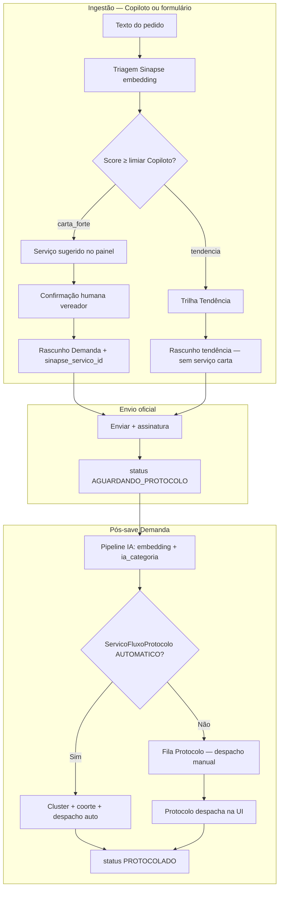

# Fluxo AUTO/MANUAL — Protocolo, Copiloto e triagem Sinapse

> **Onda 2 — P3.** Índice: [README.md](../README.md) · Roadmap: [ROADMAP_PRODUTO.md](../ROADMAP_PRODUTO.md) · API: [apis/fluxo-protocolo.md](../apis/fluxo-protocolo.md)

Este documento explica **três mecanismos distintos** que usam os termos «automático» ou «manual» no SGDL, o papel de **`SINAPSE_AUTOFILL_THRESHOLD`** e como o **Gestor** configura o despacho por serviço.

---

## Visão geral — três «AUTO/MANUAL» diferentes

| Mecanismo | O que significa «AUTO» | Onde se configura | Impacto |
|-----------|-------------------------|-------------------|---------|
| **1. Fluxo Protocolo** | Despacho automático ao órgão da carta quando o ofício entra em `AGUARDANDO_PROTOCOLO` | `FluxoServicosView` (`/gestao-fluxo-servicos`) · API `/api/fluxo-servicos/` | **Protocolo** deixa de triar manualmente aquele serviço |
| **2. Copiloto / triagem** | Sugestão de serviço Sinapse por embedding + confirmação humana no chat | `.env` (`COPILOTO_*`) · painel do Copiloto | **Vereador** escolhe/confirma serviço antes do rascunho |
| **3. Sync Sinapse (reconciliação)** | Mapeamento automático espelho SGDL ↔ carta | `sincronizar_metadados_sinapse` · `/integracoes/sinapse/reconciliacao` | **Gestor** audita integração; **não** altera despacho |

**Não confundir:** reconciliação `AUTO`/`MANUAL`/`UNMATCHED` ([runbook-sync-sinapse.md](runbook-sync-sinapse.md)) é **auditoria de sync**, não despacho Protocolo.

---

## Diagrama — do Copiloto ao protocolo

---

## 1. Fluxo Protocolo por serviço (MANUAL × AUTOMATICO)

### Modelo

- Tabela: `ServicoFluxoProtocolo` (`backend/core/models_fluxo_protocolo.py`)
- Um registro por `sinapse_servico_id` (ID na carta Sinapse)
- Campos: `modo` (`MANUAL` | `AUTOMATICO`), `ativo`, `observacoes`

### Modo efetivo

| `modo` | `ativo` | Comportamento |
|--------|---------|---------------|
| `MANUAL` | qualquer | **Padrão** — ofício fica em `AGUARDANDO_PROTOCOLO`; Protocolo despacha na fila ou no detalhe |
| `AUTOMATICO` | `false` | Tratado como manual (toggle desligado) |
| `AUTOMATICO` | `true` | **Despacho automático** habilitado para demandas elegíveis |

Propriedade calculada: `despacho_automatico = ativo and modo == AUTOMATICO`.

### Quem configura

| Recurso | Perfil |
|---------|--------|
| Tela `/gestao-fluxo-servicos` | **GESTOR** apenas (P14 — Protocolo não acessa) |
| API `POST /api/fluxo-servicos/upsert/` | **GESTOR** (403 para Protocolo) |

Serviços **sem registro** na tabela → modo efetivo **`MANUAL`**.

### Quando o despacho automático roda

Gatilhos (após demanda em `AGUARDANDO_PROTOCOLO` **com embedding**):

1. **Signal** `demanda_fluxo_automatico_pos_save` — transição de status para `AGUARDANDO_PROTOCOLO`
2. **Pipeline IA** pós-embedding — `FluxoProtocoloService.processar_cohorte_servico()` para o serviço

Implementação: `backend/core/services/fluxo_protocolo_service.py`.

### O que o despacho automático faz

Para serviços com `AUTOMATICO` ativo:

1. Resolve órgão via `sinapse_catalog.get_orgao_id_for_servico`
2. Aguarda **embedding** de todas as demandas do serviço na fila (não protocola antes do cluster)
3. **Clusteriza** pares (`ClusterService`) — mesma regra de Super OS
4. Despacha **Super OS** se cluster ≥ 2 demandas
5. Despacha **individual** demandas solitárias (respeitando regra de «par em formação»)

Usa `DemandaDespachoService.despachar(..., automatico=True)` — mesmo efeito de protocolo manual: `PROTOCOLADO`, `protocolo_executivo`, `data_inicio_prazo`.

### Exclusões — nunca despacho automático

| Condição | Motivo |
|----------|--------|
| `origem_vinculo == TENDENCIA` | Trilha malha fina — Protocolo define órgão/serviço depois |
| `tendencia_id` preenchido | Idem |
| Sem `sinapse_servico_id` | Tendência ou rascunho incompleto |
| Serviço sem órgão na carta | Log de aviso; permanece na fila |
| Pares ainda sem embedding | Adiado até pipeline IA concluir |

### Notificações

Se despacho automático está habilitado para a demanda, o signal de notificação **não** alerta usuários PROTOCOLO sobre «novo ofício na fila» (já foi protocolado).

Testes: `backend/core/tests/test_fluxo_protocolo.py`.

---

## 2. Copiloto — triagem assistiva e confirmação humana

Modo **assistivo** (regra `evolucao-sinapse-mova`): a IA **sugere**; o vereador **confirma** serviço, endereço e anexos antes de materializar o rascunho.

### Escolha do serviço no Copiloto

1. **Triagem vetorial** — `TriagemService.buscar_servico_sinapse()` (base Sinapse / carta otimizada)
2. **Classificação de trilha** — `_classificar_modo_vinculo_servico()`:
   - `carta_forte` — match forte na carta
   - `carta_dominio` — domínio operacional reconhecido (ex.: mobilidade)
   - `tendencia` — candidatos fracos → malha fina (se `COPILOTO_TENDENCIAS_ENABLED`)
3. **Painel UI** — vereador confirma `sinapse_servico_id_sugerido` (inteiro ID Sinapse, nunca só o nome)
4. **Materialização** — `_materializar_demandas()` grava `Demanda.sinapse_servico_id` e `origem_vinculo=CARTA`

Rascunho **sem serviço confirmado** não é materializado (log: «sem serviço Sinapse»).

### Formulário manual (`DemandaForm`)

Vereador também pode criar/editar rascunho escolhendo serviço na carta (`selectedServico`) — confirmação explícita na UI, sem Copiloto.

### Limiares do Copiloto (`.env`)

| Variável | Default | Uso |
|----------|---------|-----|
| `COPILOTO_CARTA_SCORE_MINIMO` | `0.6666` | Match **forte** na carta (`carta_forte`); filtro de candidatos na UI |
| `COPILOTO_CARTA_SCORE_DOMINIO` | `0.40` | Candidatos por **domínio operacional** |
| `COPILOTO_TRIAGEM_SCORE_LIMIAR` | `0.45` | Referência documentada para «fora da carta» / revisão ([apis/tendencias.md](../apis/tendencias.md)) |
| `COPILOTO_TENDENCIAS_ENABLED` | `false` | Habilita trilha Tendência no Copiloto |
| `TENDENCIA_SIMILARITY_THRESHOLD` | `0.85` | Similaridade entre ocorrências de tendência |

Código: `backend/core/services/chatbot_service.py`, `backend/config/settings.py`, `backend/.env.example`.

### Trilha Tendência vs Carta

| Trilha | `origem_vinculo` | `sinapse_servico_id` no envio | Fluxo automático |
|--------|------------------|-------------------------------|------------------|
| Carta | `CARTA` | Preenchido | Pode ser AUTOMATICO se configurado |
| Tendência | `TENDENCIA` | **Anulado** no envio (`views.py` enviar) | **Sempre manual** no Protocolo |

---

## 3. `SINAPSE_AUTOFILL_THRESHOLD` (pipeline pós-save)

**Constante:** `0.6` em `backend/core/signals.py` (não configurável via `.env` hoje).

**Escopo:** preenchimento **assistivo** do campo `Demanda.ia_categoria` quando:

- O pipeline IA assíncrono roda após save (`demanda_gerar_embedding_post_save`)
- `ia_categoria` ainda está **vazia**
- Existe embedding e triagem Sinapse retorna top-1 com `score >= 0.6`

**Não faz:**

- Não altera `sinapse_servico_id` (serviço continua escolhido pelo usuário/Copiloto)
- Não dispara despacho automático sozinho
- Não substitui classificação Groq quando o LLM já preencheu `ia_categoria`

**Auditoria:** resultados da triagem Sinapse são logados (`Triagem Sinapse demanda pk=… top=…`).

Para alterar o limiar hoje: editar `SINAPSE_AUTOFILL_THRESHOLD` em `signals.py` e rodar testes de regressão.

---

## 4. Reconciliação Sinapse (referência)

Status `AUTO` / `MANUAL` / `UNMATCHED` em `SinapseServiceSync` / `SinapseServicoMap` referem-se ao **espelho auditável** no PostgreSQL do SGDL, não ao fluxo Protocolo.

- Tela: `/integracoes/sinapse/reconciliacao` (**GESTOR**)
- Runbook: [runbook-sync-sinapse.md](runbook-sync-sinapse.md)
- **Triagem operacional** continua lendo carta Sinapse ao vivo via `sinapse_catalog`

---

## Matriz de decisão rápida (operador)

| Pergunta | Resposta |
|----------|----------|
| Quero que o Protocolo não despache «Tapa-buraco» manualmente? | Gestor: `/gestao-fluxo-servicos` → serviço → **Despacho automático** + ativo |
| Ofício de tendência pode protocolar sozinho? | **Não** — sempre fila Protocolo |
| Copiloto pode gravar serviço sem o vereador clicar? | **Não** — confirmação no painel / materialização exige ID Sinapse |
| Por que `ia_categoria` mudou sozinha? | Pipeline IA + score Sinapse ≥ 0.6 (autofill categoria) |
| Protocolo não vê menu «Fluxo por serviço»? | Correto (P14) — só **Gestor** |

---

## Checklist homologação (P3)

- [ ] Gestor altera serviço para AUTOMATICO → ofício carta vai a `PROTOCOLADO` sem ação manual (com embedding)
- [ ] Mesmo serviço em MANUAL → permanece `AGUARDANDO_PROTOCOLO` até despacho na UI
- [ ] Demanda tendência nunca auto-despacha
- [ ] Copiloto: serviço só materializa após confirmação no painel
- [ ] Documentação lida por Protocolo distingue «fluxo automático» de «sync AUTO»

---

## Referências de código

| Arquivo | Conteúdo |
|---------|----------|
| `backend/core/models_fluxo_protocolo.py` | Modelo `ServicoFluxoProtocolo` |
| `backend/core/services/fluxo_protocolo_service.py` | Coorte, cluster, despacho auto |
| `backend/core/views_fluxo_protocolo.py` | API REST |
| `backend/core/signals.py` | `SINAPSE_AUTOFILL_THRESHOLD`, gatilhos pós-save |
| `backend/core/services/chatbot_service.py` | Copiloto, limiares, materialização |
| `backend/core/services/triagem_service.py` | Busca serviço Sinapse |
| `backend/core/views.py` | `enviar` → `AGUARDANDO_PROTOCOLO` |
| `frontend/src/views/FluxoServicosView.vue` | UI gestão fluxo |
| `backend/core/tests/test_fluxo_protocolo.py` | Testes automatizados |

**Última atualização:** 2026-06-10 · Onda 2 P3.
